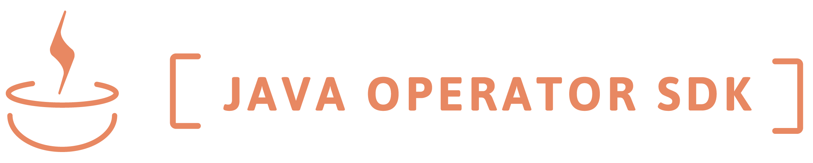

# 

# Build Kubernetes Operators in Java Without Hassle 

Java Operator SDK is a production-ready framework that makes implementing Kubernetes Operators in Java easy. 

It provides a controller runtime, support for testing operators, and related tooling. In addition to that implementing
conversion hooks and dynamic admission controllers are supported as a separate project 
(and much more, see related projects section).

Under the hood it uses the excellent [Fabric8 Kubernetes Client](https://github.com/fabric8io/kubernetes-client),
which provides additional facilities, like generating CRD from source code (and vice versa). 

  

Java Operator SDK is a CNCF project as a subproject of Operator Framework. 

## Documentation

Documentation can be found on the  **[JOSDK WebSite](https://javaoperatorsdk.io/)**.

## Contact us

Join us on [Discord](https://discord.gg/DacEhAy) or feel free to ask any question on 
[Kubernetes Slack Operator Channel](https://kubernetes.slack.com/archives/CAW0GV7A5)

**Meet us** every other Tuesday 15:00 CEST (from 29.10.2024) at our **community meeting** on [Zoom](https://zoom.us/j/8415370125)
(Password in the Discord channel, or just ask for it there!)

## How to Contribute

See the [contribution](https://javaoperatorsdk.io/docs/contributing) guide on the website.

## What is Java Operator SDK

Java Operator SDK is a higher level framework and related tooling to support writing Kubernetes Operators in Java.
It makes it easy to implement best practices and patterns for an Operator. Features include: 

* Optimal handling Kubernetes API events
* Handling dependent resources, related events, and caching.
* Automatic Retries
* Smart event scheduling
* Easy to use Error Handling
* ... and everything that a batteries included framework needs 

For all features and their usage see the [related section on the website](https://javaoperatorsdk.io/docs/features). 

## Related Projects

* Quarkus Extension: https://github.com/quarkiverse/quarkus-operator-sdk
* Spring Boot Starter: https://github.com/java-operator-sdk/operator-framework-spring-boot-starter
* Kubernetes Glue Operator: https://github.com/java-operator-sdk/kubernetes-glue-operator 
  Meta-operator that builds upon to use JOSDK Workflows and Dependent Resources features and 
  allows to create operators by simply applying a custom resource, thus, is a language independent way. 
* Kubernetes Webhooks Framework: https://github.com/java-operator-sdk/kubernetes-webooks-framework
  Framework to implement Admission Controllers and Conversion Hooks.
* Operator SDK plugin: https://github.com/operator-framework/java-operator-plugins

## Projects using JOSDK

While we know of multiple projects using JOSDK in production, we don't want to presume these 
projects want to advertise that fact here. For this reason, we ask that if you'd like your project 
to be featured in this section, please open a PR, adding a link to and short description of your 
project, as shown below:

- [ExposedApp operator](https://github.com/halkyonio/exposedapp-rhdblog): a sample operator 
  written to illustrate JOSDK concepts and its Quarkus extension in the ["Write Kubernetes 
  Operators in Java with the Java Operator SDK" blog series](https://developers.redhat.com/articles/2022/02/15/write-kubernetes-java-java-operator-sdk#).
- [Keycloak operator](https://github.com/keycloak/keycloak/tree/main/operator): the official
  Keycloak operator, built with Quarkus and JOSDK.
- [Apache Flink Kubernetes operator](https://github.com/apache/flink-kubernetes-operator) is the market leader among Flink operators.
- [Apache Spark Kubernetes Operator](https://github.com/apache/spark-kubernetes-operator) emerging operator for Spark.
- [Strimzi Access operator](https://github.com/strimzi/kafka-access-operator). While the core Strimzi operator development predates  
  JOSDK, but new components like the Access operator is using the framework.
- [EureKubeOperator](https://medium.com/@heesuk.dev/implementing-kubernetes-operator-for-eureka-service-discovery-integration-by-java-operator-sdk-d21d8087c38e): integrates service discovery of Eureka and Kubernetes using the framework - developed by 11street. It is not released as an open source yet but is very interesting to read about this problem and how it is solved by an operator written with JOSDK.
- [Locust k8s operator](https://github.com/AbdelrhmanHamouda/locust-k8s-operator): Cloud native solution to run performance tests on any Kubernetes cluster.
- [Strimzi Schema Registry Operator](https://github.com/shangyuantech/strimzi-registry-ksql-operator): A Schema Registry Operator based on JOSDK for running the Confluent Schema Registry with a Strimzi-based Kafka cluster.
- [Airflow Dag Operator](https://github.com/cdmikechen/airflow-dag-operator): Use JOSDK(Quarkus Extension) to replace Airflow Git Sync strategy. The main idea of the project is to start a synchronization container on each airflow pod to synchronize the DAG/files into the DAG folder.
- [Glasskube Operator](https://github.com/glasskube/operator): simplifies the deployment, maintenance and upgrade of popular open source business tools. It is written in Kotlin and uses the JOSDK and fabric8 Kubernetes client with Kotlin-based DSL.
- [Debezium Operator](https://github.com/debezium/debezium-operator): Debezium Operator adds Change-Data-Capture capabilities to your Kubernetes or Openshift cluster by  providing an easy way to run and manage  [Debezium Server](https://debezium.io/documentation/reference/stable/operations/debezium-server.html) instances.
