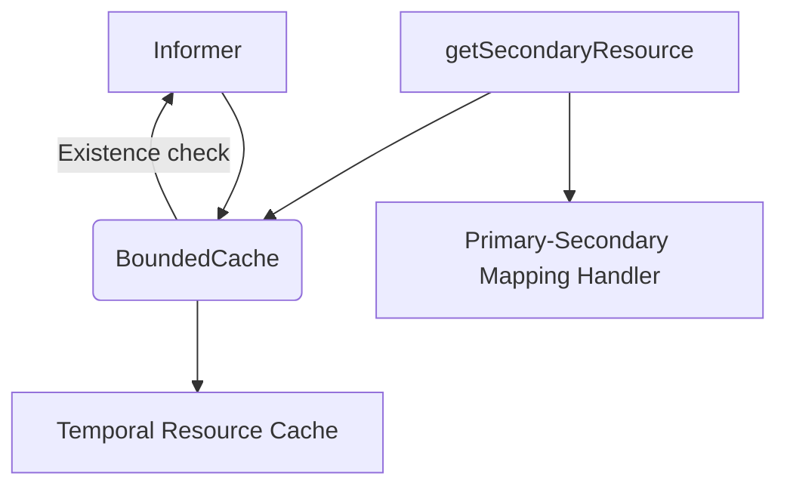

# Architecture of Caches, EventSources, Event Mapping

## Status

Pending

## Context

## Decision

```mermaid

graph TD
    A[Informer] --> B(BoundedCache)
    B --> E[Temporal Resource Cache]
    B --> |Existence check| A    
    C[getSecondaryResource] --> D[Primary-Secondary Mapping Handler] 
    C --> B
    
    
```

What is the change that we're proposing and/or doing?

## Consequences

## Notes
