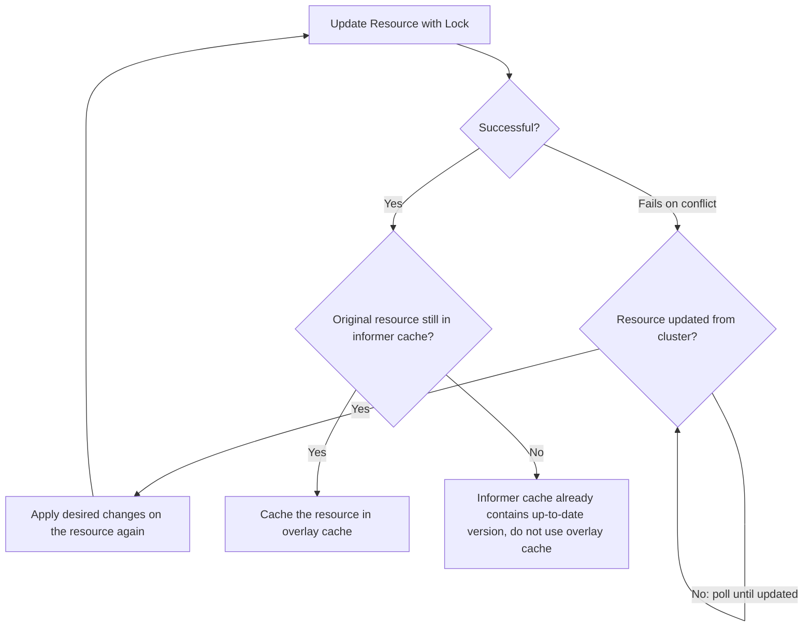

We recently released v5.1 of Java Operator SDK (JOSDK). One of the highlights of this release is related to a topic of
so-called
[allocated values](https://github.com/kubernetes/community/blob/master/contributors/devel/sig-architecture/api-conventions.md#representing-allocated-values
).

To describe the problem, let's say that our controller needs to create a resource that has a generated identifier, i.e.
a resource which identifier cannot be directely derived from the custom resource's desired state as specified in its
`spec` field. In order to record the fact that the resource was successfully created, and to avoid attempting to
recreate the resource again in subsequent reconciliations, it is typical for this type of controller to store the
generated identifier in the custom resource's `status` field.

The Java Operator SDK relies on the informers' cache to retrieve resources. These caches, however, are only guaranteed
to be eventually consistent. It could happen, then, that, if some other event occurs, that would result in a new
reconciliation, **before** the update that's been made to our resource status has the chance to be propagated first to
the cluster and then back to the informer cache, that the resource in the informer cache does **not** contain the latest
version as modified by the reconciler. This would result in a new reconciliation where the generated identifier would be
missing from the resource status and, therefore, another attempt to create the resource by the reconciler, which is not
what we'd like.

Java Operator SDK now provides a utility class [
`PrimaryUpdateAndCacheUtils`](https://github.com/operator-framework/java-operator-sdk/blob/main/operator-framework-core/src/main/java/io/javaoperatorsdk/operator/api/reconciler/PrimaryUpdateAndCacheUtils.java)
to handle this particular use case. Using that overlay cache, your reconciler is guaranteed to see the most up-to-date
version of the resource on the next reconciliation:

```java

@Override
public UpdateControl<StatusPatchCacheCustomResource> reconcile(
        StatusPatchCacheCustomResource resource,
        Context<StatusPatchCacheCustomResource> context) {

    // omitted code

    var freshCopy = createFreshCopy(resource); // need fresh copy just because we use the SSA version of update
    freshCopy
            .getStatus()
            .setValue(statusWithAllocatedValue());

    // using the utility instead of update control to patch the resource status
    var updated =
            PrimaryUpdateAndCacheUtils.ssaPatchStatusAndCacheResource(resource, freshCopy, context);
    return UpdateControl.noUpdate();
}
```

How does `PrimaryUpdateAndCacheUtils` work?
There are multiple ways to solve this problem, but ultimately, we only provide the solution described below. If you
want to dig deep in alternatives, see
this [PR](https://github.com/operator-framework/java-operator-sdk/pull/2800/files).

The trick is to intercept the resource that the reconciler updated and cache that version in an additional cache on top
of the informer's cache. Subsequently, if the reconciler needs to read the resource, the SDK will first check if it is
in the overlay cache and read it from there if present, otherwise read it from the informer's cache. If the informer
receives an event with a fresh resource, we always remove the resource from the overlay cache, since that is a more
recent resource. But this **works only** if the reconciler updates the resource using **with optimistic locking**, which
is handled for you by `PrimaryUpdateAndCacheUtils` provided you pass it a "fresh" (i.e. a version of the resource that
only contains the fields you care about being updated) copy of the resource since Server-Side Apply will be used
underneath. If the update fails on conflict, because the resource has already been updated on the cluster before we got
the chance to get our update in, we simply wait and poll the informer cache until the new resource version from the
server appears in the informer's cache,
and then try to apply our updates to the resource again using the updated version from the server, again with optimistic
locking.

So why is optimistic locking required? We hinted at it above, but the gist of it, is that if another party updates the
resource before we get a chance to, we wouldn't be able to properly handle the resulting situation correctly in all
cases. The informer would receive that new event before our own update would get a chance to propagate. Without
optimistic locking, there wouldn't be a fail-proof way to determine which update should prevail (i.e. which occurred
first), in particular in the event of the informer losing the connection to the cluster or other edge cases (the joys of
distributed computing!).

Optimistic locking simplifies the situation and provides us with stronger guarantees: if the update succeeds, then we
can be sure we have the proper resource version in our caches. The next event will contain our update in all cases.
Because we know that, we can also be sure that we can evict the cached resource in the overlay cache whenever we receive
a new event. The overlay cache is only used if the SDK detects that the original resource (i.e. the one before we
applied our status update in the example above) is still in the informer's cache.

The following diagram sums up the process:


