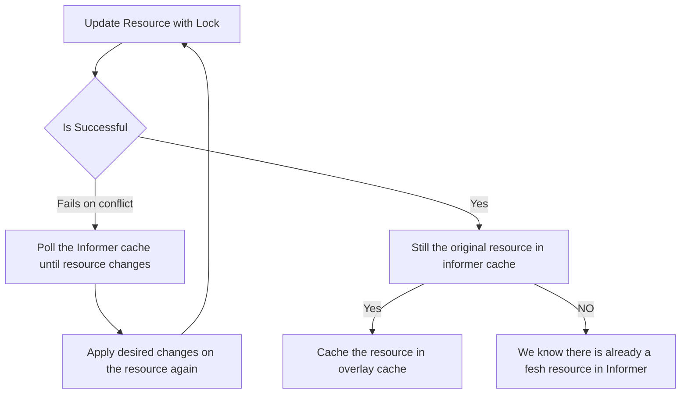

We recently released v5.1 of Java Operator SDK. One of the highlights of this release is related to a topic of so-called
[allocated values](https://github.com/kubernetes/community/blob/master/contributors/devel/sig-architecture/api-conventions.md#representing-allocated-values
) in Kubernetes.

To sum up the problem, let's say if we create a resource from our controller that has a generated ID - 
in other words, we cannot address the resource only by using the values from the `.spec` -
we have to store this ID, usually in the `.status` of the custom resource. However, operator frameworks cache resources
using informers, so the update that you made to the status of the custom resource will just eventually get into 
the cache of the informer. If meanwhile some other event triggers the reconciliation, it can happen that we will 
see the stale custom resource in the cache (in another word, the cache is eventually consistent) without the generated ID in the status. 
This is a problem since we might not know at that point that the desired resources were already created, so it might happen that you try to 
create them again. 

Java Operator SDK now out of the box provides a utility class [`PrimaryUpdateAndCacheUtils`](https://github.com/operator-framework/java-operator-sdk/blob/main/operator-framework-core/src/main/java/io/javaoperatorsdk/operator/api/reconciler/PrimaryUpdateAndCacheUtils.java)
if you use it, the framework guarantees that the next reconciliation will always receive the updated resource:

```java
 @Override
  public UpdateControl<StatusPatchCacheCustomResource> reconcile(
      StatusPatchCacheCustomResource resource,
      Context<StatusPatchCacheCustomResource> context) {
    
    // omitted code
    
    var freshCopy = createFreshCopy(resource); // need fresh copy just because we use the SSA version of update
    freshCopy
        .getStatus()
        .setValue(statusWithAllocatedValue());

    // using the utility instead of update control
    var updated =
        PrimaryUpdateAndCacheUtils.ssaPatchStatusAndCacheResource(resource, freshCopy, context);
    return UpdateControl.noUpdate();
  }
```

This utility class will do the magic for you. But how does it work? 
There are multiple ways to solve this problem, 
but ultimately, we only provided the solution below. (If you want to dig deep in alternatives, see this [PR](https://github.com/operator-framework/java-operator-sdk/pull/2800/files)).

The trick is to cache the resource from the response of our update in an additional cache on top of the informer's cache.
If we read the resource, we first check if it is in the overlay cache and read it from there if present, otherwise read it from the cache of the informer. 
If the informer receives an event with that resource, we always remove the resource from the overlay 
cache, since that is a more recent resource. But this **works only** if the update is done **with optimistic locking**.
So if the update fails on conflict, we simply wait and poll the informer cache until there is a new resource version,
and try to update again using the new resource (applied our changes again) with optimistic locking.

So why optimistic locking? (A bit simplified explanation) Note that if we do not update the resource with optimistic locking, it can happen that
another party does an update on the resource just before we do. The informer receives the event from another party's update,
if we would compare resource versions with this resource and the previously cached resource (response from our update), 
that would be different, and in general there is no elegant way to determine if this new version that 
informer receives an event from an update that happened before or after our update. 
(Note that informers watch can lose connection and other edge cases)





If we do our update with optimistic locking, it simplifies the situation, we can easily have strong guarantees.
Since we know if the update with optimistic locking is successful, we have the fresh resource in our cache. 
Thus, the next event we receive will be the one that is the result of our update 
(or a newer one if somebody did an update after, but that is fine since it will contain our allocated values). 
So if we cache the resource in the overlay cache from the response, we know that with the next event, we can remove it from there.
Note that we store the result in overlay cache only if at that time we still have the original resource in cache,
if the cache already updated. This means that we already received a new event after our update, 
so we have a fresh resource in the informer cache.  
