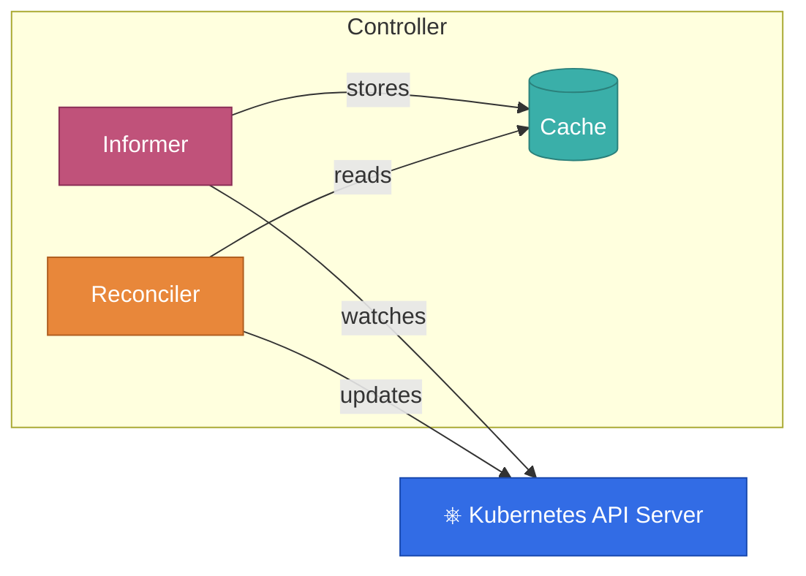
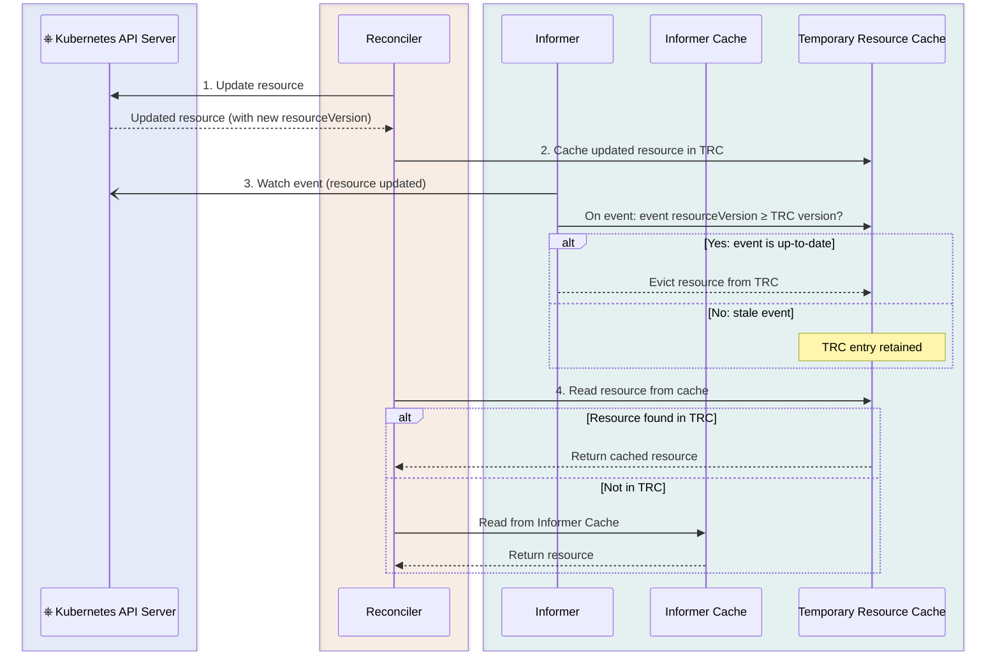

**TL;DR:**
In version 5.3.0 we introduced strong consistency guarantees for updates with a new API.
You can now update resources (both your custom resource and managed resources)
and the framework will guarantee that these updates will be instantly visible
when accessing resources from caches,
and naturally also for subsequent reconciliations.

I briefly [talked about this](https://www.youtube.com/watch?v=HrwHh5Yh6AM&t=1387s) topic at KubeCon last year.

```java
public UpdateControl<WebPage> reconcile(WebPage webPage, Context<WebPage> context) {
    
    ConfigMap managedConfigMap = prepareConfigMap(webPage);
    // apply the resource with new API
    context.resourceOperations().serverSideApply(managedConfigMap);
    
    // fresh resource instantly available from our update in the caches
    var upToDateResource = context.getSecondaryResource(ConfigMap.class);
    
    // from now on built-in update methods by default use this feature;
    // it is guaranteed that resource changes will be visible for next reconciliation
    return UpdateControl.patchStatus(alterStatusObject(webPage));
}
```

In addition to that, the framework will automatically filter events for your own updates,
so they don't trigger the reconciliation again.

{}
**This should significantly simplify controller development, and will make reconciliation
much simpler to reason about!**
{}

This post will deep dive into this topic, exploring the details and rationale behind it.

See the related umbrella [issue](https://github.com/operator-framework/java-operator-sdk/issues/2944) on GitHub.

## Informers and eventual consistency

First, we have to understand a fundamental building block of Kubernetes operators: Informers.
Since there is plentiful accessible information about this topic, here's a brief summary. Informers:

1. Watch Kubernetes resources — the K8S API sends events if a resource changes to the client
   through a websocket. An event usually contains the whole resource. (There are some exceptions, see Bookmarks.)
   See details about watch as a K8S API concept in the [official docs](https://kubernetes.io/docs/reference/using-api/api-concepts/#semantics-for-watch).
2. Cache the latest state of the resource.
3. If an informer receives an event in which the `metadata.resourceVersion` is different from the version
   in the cached resource, it calls the event handler, thus in our case triggering the reconciliation.

A controller is usually composed of multiple informers: one tracking the primary resource, and
additional informers registered for each (secondary) resource we manage.
Informers are great since we don't have to poll the Kubernetes API — it is push-based. They also provide
a cache, so reconciliations are very fast since they work on top of cached resources.

Now let's take a look at the flow when we update a resource:




It is easy to see that the cache of the informer is eventually consistent with the update we sent from the reconciler.
It usually takes only a very short time (a few milliseconds) to sync the caches and everything is fine. Well, sometimes
it isn't. The websocket can be disconnected (which actually happens on purpose sometimes), the API Server can be slow, etc.


## The problem(s) we try to solve

Let's consider an operator with the following requirements:
 - we have a custom resource `PrefixedPod` where the spec contains only one field: `podNamePrefix`
 - the goal of the operator is to create a Pod with a name that has the prefix and a random suffix
 - it should never run two Pods at once; if the `podNamePrefix` changes, it should delete
   the current Pod and then create a new one
 - the status of the custom resource should contain the `generatedPodName`

How the code would look in 5.2.x:

```java 

public UpdateControl<PrefixedPod> reconcile(PrefixedPod primary, Context<PrefixedPod> context) {
    
    Optional<Pod> currentPod = context.getSecondaryResource(Pod.class);
    
    if (currentPod.isPresent()) {
        if (podNameHasPrefix(primary.getSpec().getPodNamePrefix() ,currentPod.get())) {
            // all ok we can return
            return UpdateControl.noUpdate();
        } else {
            // deletes the current pod with different name pattern
            context.getClient().resource(currentPod.get()).delete();
           // return; pod delete event will trigger the reconciliation
           return UpdateControl.noUpdate();
        }
    } else {
        // creates new pod
       var newPod = context.getClient().resource(createPodWithOwnerReference(primary)).serverSideApply();
       return UpdateControl.patchStatus(setGeneratedPodNameToStatus(primary,newPod));
    }
}

@Override
public List<EventSource<?, PrefixedPod>> prepareEventSources(EventSourceContext<PrefixedPod> context) {
    // Code omitted for adding InformerEventSource for the Pod
}
```

That is quite simple: if there is a Pod with a different name prefix we delete it, otherwise we create the Pod
and update the status. The Pod is created with an owner reference, so any update on the Pod will trigger
the reconciliation.

Now consider the following sequence of events:

1. We create a `PrefixedPod` with `spec.podNamePrefix`: `first-pod-prefix`.
2. Concurrently:
   - The reconciliation logic runs and creates a Pod with a generated name suffix: "first-pod-prefix-a3j3ka";
   it also sets this in the status and updates the custom resource status.
   - While the reconciliation is running, we update the custom resource to have the value
    `second-pod-prefix`.
3. The update of the custom resource triggers the reconciliation.

When the spec change triggers the reconciliation in point 3, there is absolutely **no guarantee** that:
- the created Pod will already be visible — `currentPod` might simply be empty
- the `status.generatedPodName` will be visible

Since both are backed by an informer and the caches of those informers are only eventually consistent with our updates,
the next reconciliation would create a new Pod, violating the requirement to not have two
Pods running at the same time. In addition, the controller would override the status. Although in the case of a Kubernetes
resource we can still find the existing Pods later via owner references, if we were managing a
non-Kubernetes (external) resource we would not notice that we had already created one.

So can we have stronger guarantees regarding caches? It turns out we can now...

## Achieving read-cache-after-write consistency

When we send an update (this also applies to various create and patch requests) to the Kubernetes API, in the response
we receive the up-to-date resource with the resource version that is the most recent at that point.
The idea is that we can cache this response in a cache on top of the Informer's cache.
We call this cache `TemporaryResourceCache` (TRC), and besides caching such responses, it also plays a role in event filtering
as we will see later.

Note that the challenge in the past was knowing when to evict this response from the TRC. Eventually,
we will receive an event in the informer and the informer cache will be populated with an up-to-date resource.
But it was not possible to reliably tell whether an event contained a resource that was the result
of an update before or after our own update. The reason is that the Kubernetes documentation stated that
`metadata.resourceVersion` should be treated as an opaque string and matched only with equality.
Although with optimistic locking we were able to overcome this issue — see [this blog post](primary-cache-for-next-recon.md).

{}
This changed in the Kubernetes guidelines. Now, if we can parse the `resourceVersion` as an integer,
we can use numerical comparison. See the related [KEP](https://github.com/kubernetes/enhancements/tree/master/keps/sig-api-machinery/5504-comparable-resource-version).
{}

From this point the idea of the algorithm is very simple:

1. After updating a Kubernetes resource, cache the response in the TRC.
2. When the informer propagates an event, check if its resource version is greater than or equal to
   the one in the TRC. If yes, evict the resource from the TRC.
3. When the controller reads a resource from cache, it checks the TRC first, then falls back to the Informer's cache.
    



## Filtering events for our own updates

When we update a resource, eventually the informer will propagate an event that would trigger a reconciliation.
However, this is mostly not desired. Since we already have the up-to-date resource at that point,
we would like to be notified only if the resource is changed after our change.
Therefore, in addition to caching the resource, we also filter out events that contain a resource
version older than or equal to our cached resource version.

Note that the implementation of this is relatively complex, since while performing the update we want to record all the
events received in the meantime and decide whether to propagate them further once the update request is complete.

However, this way we significantly reduce the number of reconciliations, making the whole process much more efficient.  

### The case for instant reschedule

We realize that some of our users might rely on the fact that reconciliation is triggered by their own updates.
To support backwards compatibility, or rather a migration path, we now provide a way to instruct the framework
to queue an instant reconciliation:

```java
public UpdateControl<WebPage> reconcile(WebPage webPage, Context<WebPage> context) {
 
    // omitted reconciliation logic
    
   return UpdateControl.<WebPage>noUpdate().reschedule();
}
```

## Additional considerations and alternatives

An alternative approach would be to not trigger the next reconciliation until the
target resource appears in the Informer's cache. The upside is that we don't have to maintain an
additional cache of the resource, just the target resource version; therefore this approach might have
a smaller memory footprint, but not necessarily. See the related [KEP](https://github.com/kubernetes/enhancements/tree/master/keps/sig-api-machinery/5647-stale-controller-handling#proposal)
that takes this approach.

On the other hand, when we make a request, the response object is always deserialized regardless of whether we are going
to cache it or not. This object in most cases will be cached for a very short time and later garbage collected.
Therefore, the memory overhead should be minimal.

Having the TRC has an additional advantage: since we have the resource instantly in our caches, we can
elegantly continue the reconciliation in the same pass and reconcile resources that depend
on the latest state. More concretely, this also helps with our [Dependent Resources / Workflows](../../docs/documentation/dependent-resource-and-workflows/workflows.md#reconcile-sample)
which rely on up-to-date caches. In this sense, this approach is much more optimal regarding throughput.

## Conclusion

I personally worked on a prototype of an operator that depended on an unreleased version of JOSDK already
implementing these features. The most obvious gain was how much simpler the reasoning became in some cases and how it reduced the corner
cases that we would otherwise have to solve with the [expectation pattern](https://ahmet.im/blog/controller-pitfalls/#expectations-pattern)
or other facilities.

## Special thanks

I would like to thank all the contributors who directly or indirectly contributed, including [metacosm](https://github.com/metacosm),
[manusa](https://github.com/manusa), and [xstefank](https://github.com/xstefank).

Last but certainly not least, special thanks to [Steven Hawkins](https://github.com/shawkins),
who maintains the Informer implementation in the [fabric8 Kubernetes client](https://github.com/fabric8io/kubernetes-client)
and implemented the first version of the algorithms. We then iterated on it together multiple times.
Covering all the edge cases was quite an effort.
Just as a highlight, I'll mention the [last one](https://github.com/operator-framework/java-operator-sdk/issues/3208).

Thank you!

## Related

- Same initiative in golang [controller-runtime]((https://github.com/kubernetes-sigs/controller-runtime/issues/3320))
- [Comparable Resource Versions](https://github.com/kubernetes/enhancements/tree/master/keps/sig-api-machinery/5504-comparable-resource-version) in Kubernetes
- [Stale Controller Handling](https://github.com/kubernetes/enhancements/tree/master/keps/sig-api-machinery/5647-stale-controller-handling) KEP

