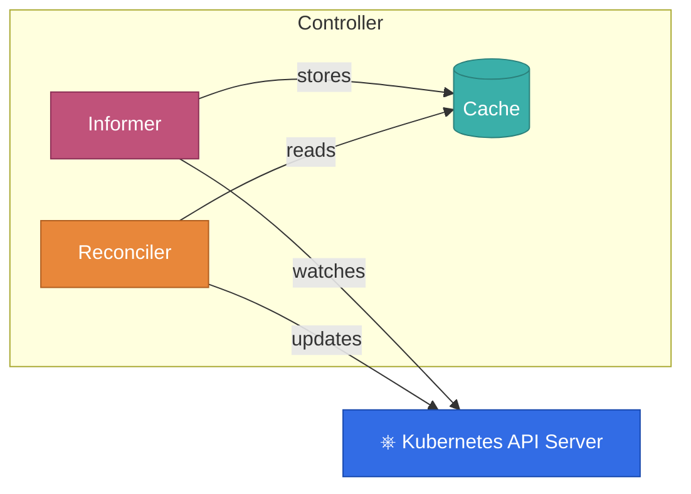

**TL;DR:** 
In version 5.3.0 we introduced strong consistency guarantees for updates. 
You can now update resources (both your custom resoure and managed resource)
and the framwork will guaratee that these updates will be instantly visible, 
thus when accessing resources from caches; 
and naturally also for subsequent reconciliations.

I briefly [talked about this](https://www.youtube.com/watch?v=HrwHh5Yh6AM&t=1387s) topic at KubeCon last year.

```java 

public UpdateControl<WebPage> reconcile(WebPage webPage, Context<WebPage> context) {
    
    ConfigMap managedConfigMap = prepareConfigMap(webPage);
    // apply the resource with new API
    context.resourceOperations().serverSideApply(managedConfigMap);
    
    // fresh resource instantly available from our update in the caches
    var upToDateResource = context.getSecondaryResource(ConfigMap.class);
    
    // from now on built in update methods by default use this feature;
    // it is guaranteed that resource  changes will be visible for next reconciliation
    return UpdateControl.patchStatus(alterStatusObject(webPage));
}
```

In addition to that framework will automatically filter events for your own updates,
so those are not triggering the reconciliation again.

{}
**This should significantly simplify controller development, and will make reconciliation
much simpler to reason about!**
{}

This post will deep dive in this topic, explore the details and rationale behind it.

## Informers and eventual consistency

First we have to understand a fundamental building block of Kubernetes operators: Informers.
Since there is plentiful accessible information about this topic, just in a nutshell, informers:

1. Watches Kubernetes resources - K8S API sends events if a resource changes to the client 
   though a websocket, An event usually contains the whole resource. (There are some exceptions, see Bookmarks).
   See details about watch as K8S API concept in the [official docs](https://kubernetes.io/docs/reference/using-api/api-concepts/#semantics-for-watch). 
2. Caches the actual latest state of the resource.
3. If an informer receives and event in which the `metadata.resourceVersion` is different from the version 
   in the cached resource it call the event handled, thus in our case triggers the reconciliation.

A controller is usually composed of multiple informers, one is tracking the primary resources, and
there are also informers registered for each (secondary) resource we manage. 
Informers are great since we don't have to poll the Kubernetes API, it is push based; and they provide 
a cache, so reconciliations are very fast since they work on top of cached resources.

Now let's take a look on the flow when we do an update to a resources:




It is easy to see that, the cache of the informer is eventually consistent with the update we sent from the reconciler.
It usually just takes a very short time (few milliseconds) to sync the caches until everything is ok. Well, sometimes 
it is not. Websocket can be disconnected (actually happens on purpose sometimes), the API Server is slow etc.


## The problem(s) we try to solve

Let's consider the following operator:
 - we have a custom resource `PodPrefix` where the spec contains only one field: `podNamePrexix`,
 - goal of the operator is to create a pod with name that has the prefix and a random sequence
 - it should never run two pods at once, if the `podNamePrefix` changes it should delete
   the actual pod and after that create a new one
 - the status of the custom resource should contain the `generatedPodName`

How the code would look like in 5.2.x:

```java 

public UpdateControl<PodPrefix> reconcile(PodPrefix primary, Context<PodPrefix> context) {
    
    Optional<Pod> currentPod = context.getSecondaryResource(Pod.class);
    
    if (currentPod.isPresent()) {
        if (podNameHasPrefix(primary.getSpec().getPodNamePrexix() ,currentPod.get())) {
            // all ok we can return
            return UpdateControl.noUpdate();
        } else {
            // deletes the current pod with different name pattern
            context.getClient().resource(currentPod.get()).delete();
            // it returns pod delete event will trigger the reconciliation
           return UpdateControl.noUpdate();
        }
    } else {
        // creates new pod
       var newPod = context.getClient().resource(createPodWithOwnerReference(primary)).serviceSideApply();
       return UpdateControl.patchStatus(setPodNameToStatus(primary,newPod));
    }
}

@Override
public List<EventSource<?, WebPage>> prepareEventSources(EventSourceContext<WebPage> context) {
    
    // Code omitted for adding InformerEventsSource for the pod
   
   
}
```

That is quite simple if there is a pod with different name prefix we delete it, otherwise we create the pod
and update the status. The pod is created with an owner reference so any update on pod will trigger
the reconciliation.

Now consider the following sequence of events:

1. We create a `PodPrefix` with `podNamePrefix`: "first-pod-prefix".
2. Concurrently:
   - The reconciliation logic runs and creates a Pod with a name generated suffix: "first-pod-prefix-a3j3ka";
   also sets this to the status and updates the custom resource status.  
   - While the reconciliation is running we update the custom resource to have the value 
    "second-pod-prefix"
3. The update of the custom resource triggers the reconciliation.
