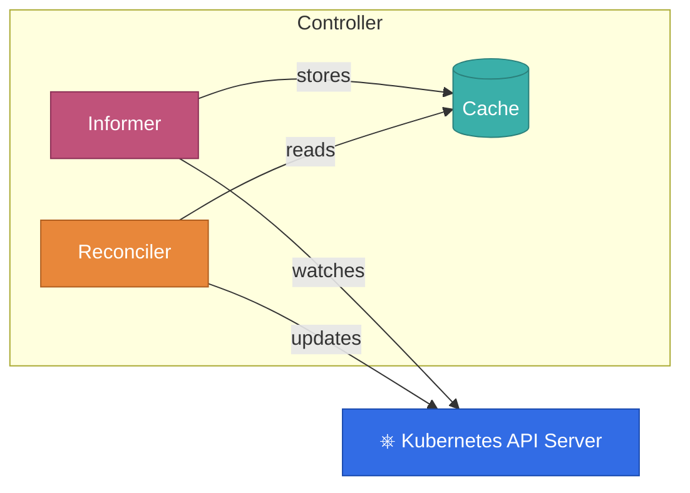
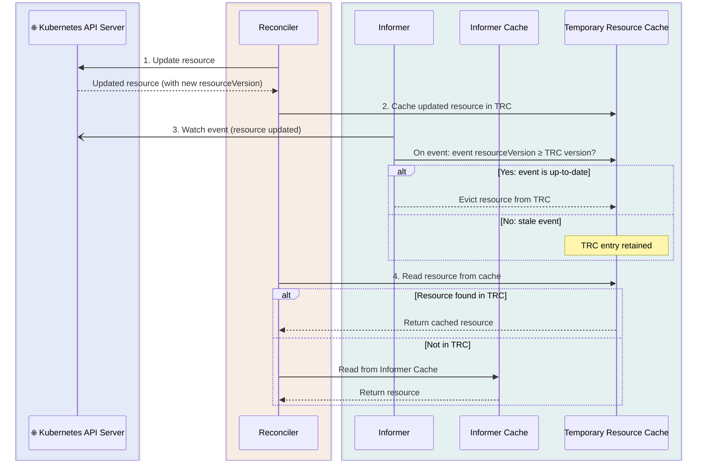

**TL;DR:** 
In version 5.3.0 we introduced strong consistency guarantees for updates. 
You can now update resources (both your custom resoure and managed resource)
and the framwork will guaratee that these updates will be instantly visible, 
thus when accessing resources from caches; 
and naturally also for subsequent reconciliations.

I briefly [talked about this](https://www.youtube.com/watch?v=HrwHh5Yh6AM&t=1387s) topic at KubeCon last year.

```java 

public UpdateControl<WebPage> reconcile(WebPage webPage, Context<WebPage> context) {
    
    ConfigMap managedConfigMap = prepareConfigMap(webPage);
    // apply the resource with new API
    context.resourceOperations().serverSideApply(managedConfigMap);
    
    // fresh resource instantly available from our update in the caches
    var upToDateResource = context.getSecondaryResource(ConfigMap.class);
    
    // from now on built in update methods by default use this feature;
    // it is guaranteed that resource  changes will be visible for next reconciliation
    return UpdateControl.patchStatus(alterStatusObject(webPage));
}
```

In addition to that framework will automatically filter events for your own updates,
so those are not triggering the reconciliation again.

{}
**This should significantly simplify controller development, and will make reconciliation
much simpler to reason about!**
{}

This post will deep dive in this topic, explore the details and rationale behind it.

## Informers and eventual consistency

First we have to understand a fundamental building block of Kubernetes operators: Informers.
Since there is plentiful accessible information about this topic, just in a nutshell, informers:

1. Watches Kubernetes resources - K8S API sends events if a resource changes to the client 
   though a websocket, An event usually contains the whole resource. (There are some exceptions, see Bookmarks).
   See details about watch as K8S API concept in the [official docs](https://kubernetes.io/docs/reference/using-api/api-concepts/#semantics-for-watch). 
2. Caches the actual latest state of the resource.
3. If an informer receives and event in which the `metadata.resourceVersion` is different from the version 
   in the cached resource it call the event handled, thus in our case triggers the reconciliation.

A controller is usually composed of multiple informers, one is tracking the primary resources, and
there are also informers registered for each (secondary) resource we manage. 
Informers are great since we don't have to poll the Kubernetes API, it is push based; and they provide 
a cache, so reconciliations are very fast since they work on top of cached resources.

Now let's take a look on the flow when we do an update to a resources:




It is easy to see that, the cache of the informer is eventually consistent with the update we sent from the reconciler.
It usually just takes a very short time (few milliseconds) to sync the caches until everything is ok. Well, sometimes 
it is not. Websocket can be disconnected (actually happens on purpose sometimes), the API Server is slow etc.


## The problem(s) we try to solve

Let's consider an operator with the following requirements:
 - we have a custom resource `PodPrefix` where the spec contains only one field: `podNamePrexix`,
 - goal of the operator is to create a pod with name that has the prefix and a random sequence suffix
 - it should never run two pods at once, if the `podNamePrefix` changes it should delete
   the actual pod and after that create a new one
 - the status of the custom resource should contain the `generatedPodName`

How the code would look like in 5.2.x:

```java 

public UpdateControl<PodPrefix> reconcile(PodPrefix primary, Context<PodPrefix> context) {
    
    Optional<Pod> currentPod = context.getSecondaryResource(Pod.class);
    
    if (currentPod.isPresent()) {
        if (podNameHasPrefix(primary.getSpec().getPodNamePrexix() ,currentPod.get())) {
            // all ok we can return
            return UpdateControl.noUpdate();
        } else {
            // deletes the current pod with different name pattern
            context.getClient().resource(currentPod.get()).delete();
            // it returns pod delete event will trigger the reconciliation
           return UpdateControl.noUpdate();
        }
    } else {
        // creates new pod
       var newPod = context.getClient().resource(createPodWithOwnerReference(primary)).serviceSideApply();
       return UpdateControl.patchStatus(setGeneratedPodNameToStatus(primary,newPod));
    }
}

@Override
public List<EventSource<?, WebPage>> prepareEventSources(EventSourceContext<WebPage> context) {
    // Code omitted for adding InformerEventsSource for the Pod
}
```

That is quite simple if there is a pod with different name prefix we delete it, otherwise we create the pod
and update the status. The pod is created with an owner reference so any update on pod will trigger
the reconciliation.

Now consider the following sequence of events:

1. We create a `PodPrefix` with `spec.podNamePrefix`: `first-pod-prefix`.
2. Concurrently:
   - The reconciliation logic runs and creates a Pod with a name generated suffix: "first-pod-prefix-a3j3ka";
   also sets this to the status and updates the custom resource status.  
   - While the reconciliation is running we update the custom resource to have the value 
    `second-pod-prefix`
3. The update of the custom resource triggers the reconciliation.

When the spec change triggers the reconciliation in point 3. there is absolutely no guarantee that:
- created pod will be already visible, this `currentPod` might be just empty
- the `status.generatedPodName` will be visible 

Since both are backed with an informer and the cache of those informers are eventually consistent with our updates.
Therefore, the next reconiliation would create a new Pod, and we just missed the requirement to not have two
Pods running at the same time. In addition to that controller will override the status. Altough in case of Kubernetes
resource we anyway can find the existing Pods later with owner references, but in case if we would manage a 
non-Kuberetes resource we would not notice that we created a resource before.

So can we have stronger guarantees regarding caches? It turns out we can now...

## Achieving read-cache-after-write consistency

When we send an update (applies also on various create and patch) requests to Kubernetes API, in the response
we receive the up-to-date resource, with the resource version that is the most recent at that point.
The idea of the implementation is that we can cache the response in a cache on top the Informer's cache. 
We call this cache `TemporaryResourceCache` (TRC) and among caching such responses has also role for event filtering
as we will see later.

Note that the challenge here was in the past, when to evict this response from the TRC. We eventually
will receive an event in informer and the informer cache will be propagated with an up-to-date resource.
But was not possible to tell reliably about an event that it contains a resource that it was a result 
of an update prior or after our update. The reason is that Kubernetes documentation stated that the
`metadata.resourceVersion` should be considered as a string, and should be matched only with equality.
Although with optimistic locking we were able to overcome this issue, see [this blogpost](primary-cache-for-next-recon.md).

{}
This changed in Kubernetes guidelines. Now if we are able to pars the `resourceVersion` as an integer
we can use numerical comparison. See related [KEP](https://github.com/michaelasp/enhancements/tree/master/keps/sig-api-machinery/5504-comparable-resource-version).
{}

From this point the idea of the algorithm is very simple:

1. After update kubernetes resource cache the response in TRC if the Informer's cache.
2. If the informer propagates an event, check if it's resource version is same or larger 
   or equals than the one in the TRC, if yes, evict the resource from TRC.
3. If the controller reads a resource from the cache first it checks if it in TRC then in Informers cache.
    



## Filtering events for our own updates

When update a resource, eventually the informer will propagate an event that will trigger the reconciliation.
However, this is mostly not something that is desired. Since we know we already know that point the up-to-date
resource, we would like to be notified only if that resource is changed after our change.
Therefore, in addition to the caching of the resource we also filter out the events which contains a resource
version that is older or has the same resource version as our cached resource.

Note that the implementation of this is relatively complex. Since while doing the update we want to record all the 
events that we received meanwhile, and make a decision to propagate any further if the update request if complete.

However, this way we significantly reduce the number of reconciliations, thus making the whole process much more efficient.  

## Additional considerations and alternatives

## Conclusion

## Notes

TODO:
- alternatives => deferring reconciliation, this is optimized for throughput
- filter events
- reschedule