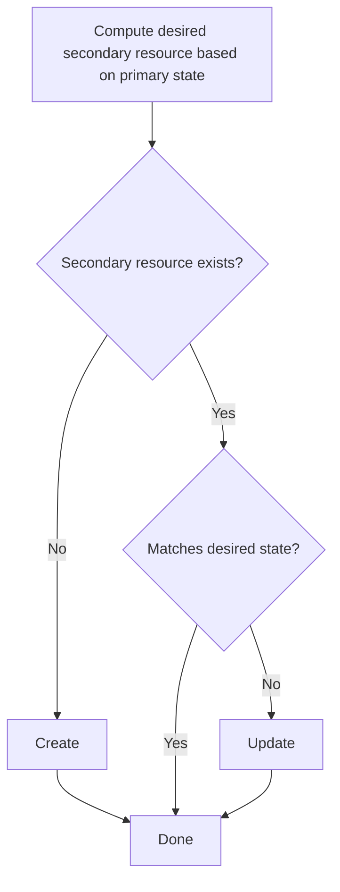

## Motivations and Goals

Most operators need to deal with secondary resources when trying to realize the desired state
described by the primary resource they are in charge of. For example, the Kubernetes-native
`Deployment` controller needs to manage `ReplicaSet` instances as part of a `Deployment`'s
reconciliation process. In this instance, `ReplicatSet` is considered a secondary resource for
the `Deployment` controller.

Controllers that deal with secondary resources typically need to perform the following steps, for
each secondary resource:



While these steps are not difficult in and of themselves, there are some subtleties that can lead to
bugs or sub-optimal code if not done right. As this process is pretty much similar for each
dependent resource, it makes sense for the SDK to offer some level of support to remove the
boilerplate code associated with encoding these repetitive actions. It should
be possible to handle common cases (such as dealing with Kubernetes-native secondary resources) in a
semi-declarative way with only a minimal amount of code, JOSDK taking care of wiring everything
accordingly.

Moreover, in order for your reconciler to get informed of events on these secondary resources, you
need to configure and create event sources and maintain them. JOSDK already makes it rather easy
to deal with these, but dependent resources makes it even simpler.

Finally, there are also opportunities for the SDK to transparently add features that are even
trickier to get right, such as immediate caching of updated or created resources (so that your
reconciler doesn't need to wait for a cluster roundtrip to continue its work) and associated
event filtering (so that something your reconciler just changed doesn't re-trigger a
reconciliation, for example).

## Design

### `DependentResource` vs. `AbstractDependentResource`

The new
[`DependentResource`](https://github.com/java-operator-sdk/java-operator-sdk/blob/main/operator-framework-core/src/main/java/io/javaoperatorsdk/operator/api/reconciler/dependent/DependentResource.java)
interface lies at the core of the design and strives to encapsulate the logic that is required
to reconcile the state of the associated secondary resource based on the state of the primary
one. For most cases, this logic will follow the flow expressed above and JOSDK provides a very
convenient implementation of this logic in the form of the
[`AbstractDependentResource`](https://github.com/java-operator-sdk/java-operator-sdk/blob/main/operator-framework-core/src/main/java/io/javaoperatorsdk/operator/processing/dependent/AbstractDependentResource.java)
class. If your logic doesn't fit this pattern, though, you can still provide your
own `reconcile` method implementation. While the benefits of using dependent resources are less
obvious in that case, this allows you to separate the logic necessary to deal with each
secondary resource in its own class that can then be tested in isolation via unit tests. You can
also use the declarative support with your own implementations as we shall see later on.

`AbstractDependentResource` is designed so that classes extending it specify which functionality
they support by implementing trait interfaces. This design has been selected to express the fact
that not all secondary resources are completely under the control of the primary reconciler:
some dependent resources are only ever created or updated for example and we needed a way to let
JOSDK know when that is the case. We therefore provide trait interfaces: `Creator`,
`Updater` and `Deleter` to express that the `DependentResource` implementation will provide custom
functionality to create, update and delete its associated secondary resources, respectively. If
these traits are not implemented then parts of the logic described above is never triggered: if
your implementation doesn't implement `Creator`, for example, `AbstractDependentResource` will
never try to create the associated secondary resource, even if it doesn't exist. It is even
possible to not implement any of these traits and therefore create read-only dependent resources
that will trigger your reconciler whenever a user interacts with them but that are never
modified by your reconciler itself - however note that read-only dependent resources rarely make
sense, as it is usually simpler to register an event source for the target resource.

All subclasses
of [`AbstractDependentResource`](https://github.com/java-operator-sdk/java-operator-sdk/blob/main/operator-framework-core/src/main/java/io/javaoperatorsdk/operator/processing/dependent/AbstractDependentResource.java)
can also implement
the [`Matcher`](https://github.com/java-operator-sdk/java-operator-sdk/blob/main/operator-framework-core/src/main/java/io/javaoperatorsdk/operator/processing/dependent/Matcher.java)
interface to customize how the SDK decides whether or not the actual state of the dependent
matches the desired state. This makes it convenient to use these abstract base classes for your
implementation, only customizing the matching logic. Note that in many cases, there is no need
to customize that logic as the SDK already provides convenient default implementations in the
form
of [`DesiredEqualsMatcher`](https://github.com/java-operator-sdk/java-operator-sdk/blob/main/operator-framework-core/src/main/java/io/javaoperatorsdk/operator/processing/dependent/DesiredEqualsMatcher.java)
and
[`GenericKubernetesResourceMatcher`](https://github.com/java-operator-sdk/java-operator-sdk/blob/main/operator-framework-core/src/main/java/io/javaoperatorsdk/operator/processing/dependent/kubernetes/GenericKubernetesResourceMatcher.java)
implementations, respectively. If you want to provide custom logic, you only need your
`DependentResource` implementation to implement the `Matcher` interface as below, which shows
how to customize the default matching logic for Kubernetes resources to also consider annotations
and labels, which are ignored by default:

```java
public class MyDependentResource extends KubernetesDependentResource<MyDependent, MyPrimary>
        implements Matcher<MyDependent, MyPrimary> {
    // your implementation

    public Result<MyDependent> match(MyDependent actualResource, MyPrimary primary,
                                     Context<MyPrimary> context) {
        return GenericKubernetesResourceMatcher.match(this, actualResource, primary, context, true);
    }
}
```

### Batteries included: convenient DependentResource implementations!

JOSDK also offers several other convenient implementations building on top of
`AbstractDependentResource` that you can use as starting points for your own implementations.

One such implementation is the `KubernetesDependentResource` class that makes it really easy to work
with Kubernetes-native resources. In this case, you usually only need to provide an implementation
for the `desired` method to tell JOSDK what the desired state of your secondary resource should
be based on the specified primary resource state.

JOSDK takes care of everything else using default implementations that you can override in case you
need more precise control of what's going on.

We also provide implementations that make it easy to cache
(`AbstractExternalDependentResource`) or poll for changes in external resources
(`PollingDependentResource`, `PerResourcePollingDependentResource`). All the provided
implementations can be found in the `io/javaoperatorsdk/operator/processing/dependent` package of
the `operator-framework-core` module.

### Sample Kubernetes Dependent Resource

A typical use case, when a Kubernetes resource is fully managed - Created, Read, Updated and
Deleted (or set to be garbage collected). The following example shows how to create a
`Deployment` dependent resource:

```java

@KubernetesDependent(informer = @Informer(labelSelector = SELECTOR))
class DeploymentDependentResource extends CRUDKubernetesDependentResource<Deployment, WebPage> {

    @Override
    protected Deployment desired(WebPage webPage, Context<WebPage> context) {
        var deploymentName = deploymentName(webPage);
        Deployment deployment = loadYaml(Deployment.class, getClass(), "deployment.yaml");
        deployment.getMetadata().setName(deploymentName);
        deployment.getMetadata().setNamespace(webPage.getMetadata().getNamespace());
        deployment.getSpec().getSelector().getMatchLabels().put("app", deploymentName);

        deployment.getSpec().getTemplate().getMetadata().getLabels()
                .put("app", deploymentName);
        deployment.getSpec().getTemplate().getSpec().getVolumes().get(0)
                .setConfigMap(new ConfigMapVolumeSourceBuilder().withName(configMapName(webPage)).build());
        return deployment;
    }
}
```

The only thing that you need to do is to extend the `CRUDKubernetesDependentResource` and
specify the desired state for your secondary resources based on the state of the primary one. In
the example above, we're handling the state of a `Deployment` secondary resource associated with
a `WebPage` custom (primary) resource.

The `@KubernetesDependent` annotation can be used to further configure **managed** dependent
resource that are extending `KubernetesDependentResource`.

See the full source
code [here](https://github.com/operator-framework/java-operator-sdk/blob/main/sample-operators/webpage/src/main/java/io/javaoperatorsdk/operator/sample/dependentresource/DeploymentDependentResource.java)
.

## Managed Dependent Resources

As mentioned previously, one goal of this implementation is to make it possible to declaratively
create and wire dependent resources. You can annotate your reconciler with `@Dependent`
annotations that specify which `DependentResource` implementation it depends upon.
JOSDK will take the appropriate steps to wire everything together and call your
`DependentResource` implementations `reconcile` method before your primary resource is reconciled.
This makes sense in most use cases where the logic associated with the primary resource is
usually limited to status handling based on the state of the secondary resources and the
resources are not dependent on each other. As an alternative, you can also invoke reconciliation explicitly, 
event for managed workflows.

See [Workflows](https://javaoperatorsdk.io/docs/documentation/dependent-resource-and-workflows/workflows/) for more details on how the dependent
resources are reconciled.

This behavior and automated handling is referred to as "managed" because the `DependentResource`
instances are managed by JOSDK, an example of which can be seen below:

```java

@Workflow(
        dependents = {
                @Dependent(type = ConfigMapDependentResource.class),
                @Dependent(type = DeploymentDependentResource.class),
                @Dependent(type = ServiceDependentResource.class),
                @Dependent(
                        type = IngressDependentResource.class,
                        reconcilePrecondition = ExposedIngressCondition.class)
        })
public class WebPageManagedDependentsReconciler
        implements Reconciler<WebPage>, ErrorStatusHandler<WebPage> {

    // omitted code

    @Override
    public UpdateControl<WebPage> reconcile(WebPage webPage, Context<WebPage> context) {

        final var name = context.getSecondaryResource(ConfigMap.class).orElseThrow()
                .getMetadata().getName();
        webPage.setStatus(createStatus(name));
        return UpdateControl.patchStatus(webPage);
    }
}
```

See the full source code of
sample [here](https://github.com/operator-framework/java-operator-sdk/blob/main/sample-operators/webpage/src/main/java/io/javaoperatorsdk/operator/sample/WebPageManagedDependentsReconciler.java)
.

## Standalone Dependent Resources

It is also possible to wire dependent resources programmatically. In practice this means that the
developer is responsible for initializing and managing the dependent resources as well as calling
their `reconcile` method. However, this makes it possible for developers to fully customize the
reconciliation process. Standalone dependent resources should be used in cases when the managed use
case does not fit. You can, of course, also use [Workflows](https://javaoperatorsdk.io/docs/documentation/dependent-resource-and-workflows/workflows/) when managing
resources programmatically.

You can see a commented example of how to do
so [here](https://github.com/operator-framework/java-operator-sdk/blob/main/sample-operators/webpage/src/main/java/io/javaoperatorsdk/operator/sample/WebPageStandaloneDependentsReconciler.java).

## Creating/Updating Kubernetes Resources

From version 4.4 of the framework the resources are created and updated
using [Server Side Apply](https://kubernetes.io/docs/reference/using-api/server-side-apply/)
, thus the desired state is simply sent using this approach to update the actual resource.

## Comparing desired and actual state (matching)

During the reconciliation of a dependent resource, the desired state is matched with the actual
state from the caches. The dependent resource only gets updated on the server if the actual,
observed state differs from the desired one. Comparing these two states is a complex problem
when dealing with Kubernetes resources because a strict equality check is usually not what is
wanted due to the fact that multiple fields might be automatically updated or added by
the platform (
by [dynamic admission controllers](https://kubernetes.io/docs/reference/access-authn-authz/extensible-admission-controllers/)
or validation webhooks, for example). Solving this problem in a generic way is therefore a tricky
proposition.

JOSDK provides such a generic matching implementation which is used by default:
[SSABasedGenericKubernetesResourceMatcher](https://github.com/java-operator-sdk/java-operator-sdk/blob/main/operator-framework-core/src/main/java/io/javaoperatorsdk/operator/processing/dependent/kubernetes/SSABasedGenericKubernetesResourceMatcher.java)
This implementation relies on the managed fields used by the Server Side Apply feature to
compare only the values of the fields that the controller manages. This ensures that only
semantically relevant fields are compared. See javadoc for further details.

JOSDK versions prior to 4.4 were using a different matching algorithm as implemented in
[GenericKubernetesResourceMatcher](https://github.com/java-operator-sdk/java-operator-sdk/blob/e16559fd41bbb8bef6ce9d1f47bffa212a941b09/operator-framework-core/src/main/java/io/javaoperatorsdk/operator/processing/dependent/kubernetes/GenericKubernetesResourceMatcher.java).

Since SSA is a complex feature, JOSDK implements a feature flag allowing users to switch between
these implementations. See
in [ConfigurationService](https://github.com/java-operator-sdk/java-operator-sdk/blob/main/operator-framework-core/src/main/java/io/javaoperatorsdk/operator/api/config/ConfigurationService.java#L332-L358).

It is, however, important to note that these implementations are default, generic
implementations that the framework can provide expected behavior out of the box. In many
situations, these will work just fine but it is also possible to provide matching algorithms
optimized for specific use cases. This is easily done by simply overriding
the `match(...)` [method](https://github.com/java-operator-sdk/java-operator-sdk/blob/e16559fd41bbb8bef6ce9d1f47bffa212a941b09/operator-framework-core/src/main/java/io/javaoperatorsdk/operator/processing/dependent/kubernetes/KubernetesDependentResource.java#L156-L156).

It is also possible to bypass the matching logic altogether to simply rely on the server-side
apply mechanism if always sending potentially unchanged resources to the cluster is not an issue.
JOSDK's matching mechanism allows to spare some potentially useless calls to the Kubernetes API
server. To bypass the matching feature completely, simply override the `match` method to always
return `false`, thus telling JOSDK that the actual state never matches the desired one, making
it always update the resources using SSA.

WARNING: Older versions of Kubernetes before 1.25 would create an additional resource version for every SSA update
performed with certain resources - even though there were no actual changes in the stored resource - leading to infinite
reconciliations. This behavior was seen with Secrets using `stringData`, Ingresses using empty string fields, and
StatefulSets using volume claim templates. The operator framework has added built-in handling for the StatefulSet issue.
If you encounter this issue on an older Kubernetes version, consider changing your desired state, turning off SSA for
that resource, or even upgrading your Kubernetes version. If you encounter it on a newer Kubernetes version, please log
an issue with the JOSDK and with upstream Kubernetes.

## Telling JOSDK how to find which secondary resources are associated with a given primary resource

[`KubernetesDependentResource`](https://github.com/java-operator-sdk/java-operator-sdk/blob/main/operator-framework-core/src/main/java/io/javaoperatorsdk/operator/processing/dependent/kubernetes/KubernetesDependentResource.java)
automatically maps secondary resource to a primary by owner reference. This behavior can be
customized by implementing
[`SecondaryToPrimaryMapper`](https://github.com/java-operator-sdk/java-operator-sdk/blob/main/operator-framework-core/src/main/java/io/javaoperatorsdk/operator/processing/event/source/SecondaryToPrimaryMapper.java)
by the dependent resource.

See sample in one of the integration
tests [here](https://github.com/operator-framework/java-operator-sdk/tree/main/operator-framework/src/test/java/io/javaoperatorsdk/operator/dependent/primaryindexer)
.

## Multiple Dependent Resources of Same Type

When dealing with multiple dependent resources of same type, the dependent resource implementation
needs to know which specific resource should be targeted when reconciling a given dependent
resource, since there could be multiple instances of that type which could possibly be used, each
associated with the same primary resource. In this situation, JOSDK automatically selects the appropriate secondary
resource matching the desired state associated with the primary resource. This makes sense because the desired
state computation already needs to be able to discriminate among multiple related secondary resources to tell JOSDK how
they should be reconciled.

There might be cases, though, where it might be problematic to call the `desired` method several times (for example, because it is costly to do so),
it is always possible to override this automated discrimination using several means (consider in this priority order):

- Override the [`targetSecondaryResourceID`](https://github.com/operator-framework/java-operator-sdk/blob/main/operator-framework-core/src/main/java/io/javaoperatorsdk/operator/processing/dependent/kubernetes/KubernetesDependentResource.java#L282)
  method, if your `DependentResource` extends `KubernetesDependentResource`,
  where it's very often possible to easily determine the `ResourceID` of the secondary resource. This would probably be
  the easiest solution if you're working with Kubernetes resources. Similarly, you can override the 
  [`targetSecondaryResourceID`](https://github.com/operator-framework/java-operator-sdk/blob/main/operator-framework-core/src/main/java/io/javaoperatorsdk/operator/processing/dependent/AbstractExternalDependentResource.java#L138)
  for external resources. See below the related ID handling
- If the approach above doesn't fit your needs, you can override the target resource selection mechanism by overriding
  `selectTargetSecondaryResource` for both [`KubernetesDependentResource`](https://github.com/operator-framework/java-operator-sdk/blob/main/operator-framework-core/src/main/java/io/javaoperatorsdk/operator/processing/dependent/kubernetes/KubernetesDependentResource.java#L282)
  and [`AbstractExternalDependentResource`](https://github.com/operator-framework/java-operator-sdk/blob/main/operator-framework-core/src/main/java/io/javaoperatorsdk/operator/processing/dependent/AbstractExternalDependentResource.java#L148). 
- As last resort, you can implement your own `getSecondaryResource` method on your `DependentResource` implementation from scratch.

### Sharing an Event Source Between Dependent Resources

Dependent resources usually also provide event sources. When dealing with multiple dependents of
the same type, one needs to decide whether these dependent resources should track the same
resources and therefore share a common event source, or, to the contrary, track completely
separate resources, in which case using separate event sources is advised.

Dependents can therefore reuse existing, named event sources by referring to their name. In the
declarative case, assuming a `configMapSource` `EventSource` has already been declared, this
would look as follows:

```
 @Dependent(type = MultipleManagedDependentResourceConfigMap1.class, 
   useEventSourceWithName = "configMapSource")
```

A sample is provided as an integration test both:
for [managed](https://github.com/operator-framework/java-operator-sdk/tree/main/operator-framework/src/test/java/io/javaoperatorsdk/operator/dependent/multipledrsametypenodiscriminator)

For [standalone](https://github.com/operator-framework/java-operator-sdk/blob/main/operator-framework/src/test/java/io/javaoperatorsdk/operator/dependent/multipledependentresource)
cases.

## Bulk Dependent Resources

So far, all the cases we've considered were dealing with situations where the number of
dependent resources needed to reconcile the state expressed by the primary resource is known
when writing the code for the operator. There are, however, cases where the number of dependent
resources to be created depends on information found in the primary resource.

These cases are covered by the "bulk" dependent resources feature. To create such dependent
resources, your implementation should extend `AbstractDependentResource` (at least indirectly) and
implement the
[`BulkDependentResource`](https://github.com/java-operator-sdk/java-operator-sdk/blob/main/operator-framework-core/src/main/java/io/javaoperatorsdk/operator/processing/dependent/BulkDependentResource.java)
interface.

Various examples are provided
as [integration tests](https://github.com/operator-framework/java-operator-sdk/tree/main/operator-framework/src/test/java/io/javaoperatorsdk/operator/dependent/bulkdependent)
.

To see how bulk dependent resources interact with workflow conditions, please refer to this
[integration test](https://github.com/operator-framework/java-operator-sdk/tree/main/operator-framework/src/test/java/io/javaoperatorsdk/operator/dependent/bulkdependent/conidition).

## Dependent Resources with External Resource

Dependent resources are designed to manage also non-Kubernetes or external resources.
To implement such dependent you can extend `AbstractExternalDependentResource` or one of its 
[subclasses](https://github.com/operator-framework/java-operator-sdk/blob/main/operator-framework-core/src/main/java/io/javaoperatorsdk/operator/processing/dependent/external).

For Kubernetes resources we can have nice assumptions, like
if there are multiple resources of the same type, we can select the target resource
that dependent resource manages based on the name and namespace of the desired resource;
or we can use a matcher based SSA in most of the cases if the resource is managed using SSA.

### Selecting the target resource

Unfortunately this is not true for external resources. So to make sure we are selecting
the target resources from an event source, we provide a [mechanism](https://github.com/operator-framework/java-operator-sdk/blob/main/operator-framework-core/src/main/java/io/javaoperatorsdk/operator/processing/dependent/AbstractExternalDependentResource.java#L114-L138) that helps with that logic.
Your POJO representing an external resource can implement [`ExternalResourceIDProvider`](https://github.com/operator-framework/java-operator-sdk/blob/main/operator-framework-core/src/main/java/io/javaoperatorsdk/operator/processing/dependent/ExternalDependentIDProvider.java) : 

```java

public interface ExternalDependentIDProvider<T> {

  T externalResourceId();
}
```

That will provide an ID, what is used to check for equality for desired state and resources from event source caches.
Not that if some reason this mechanism does not suit for you, you can simply 
override [`selectTargetSecondaryResource`](https://github.com/operator-framework/java-operator-sdk/blob/main/operator-framework-core/src/main/java/io/javaoperatorsdk/operator/processing/dependent/AbstractExternalDependentResource.java)
method.

### Matching external resources

By default, external resources are matched using [equality](https://github.com/operator-framework/java-operator-sdk/blob/main/operator-framework-core/src/main/java/io/javaoperatorsdk/operator/processing/dependent/AbstractExternalDependentResource.java#L88-L92).
So you can override equals of you POJO representing an external resource. 
As an alternative you can always override the whole `match` method to completely customize matching.

## External State Tracking Dependent Resources

It is sometimes necessary for a controller to track external (i.e. non-Kubernetes) state to
properly manage some dependent resources. For example, your controller might need to track the
state of a REST API resource, which, after being created, would be refer to by its identifier.
Such identifier would need to be tracked by your controller to properly retrieve the state of
the associated resource and/or assess if such a resource exists. While there are several ways to
support this use case, we recommend storing such information in a dedicated Kubernetes resources
(usually a `ConfigMap` or a `Secret`), so that it can be manipulated with common Kubernetes
mechanisms.

This particular use case is supported by the
[`AbstractExternalDependentResource`](https://github.com/java-operator-sdk/java-operator-sdk/blob/main/operator-framework-core/src/main/java/io/javaoperatorsdk/operator/processing/dependent/AbstractExternalDependentResource.java)
class that you can extend to suit your needs, as well as implement the
[`DependentResourceWithExplicitState`](https://github.com/java-operator-sdk/java-operator-sdk/blob/main/operator-framework-core/src/main/java/io/javaoperatorsdk/operator/processing/dependent/DependentResourceWithExplicitState.java)
interface. Note that most of the JOSDK-provided dependent resource implementations such as
`PollingDependentResource` or `PerResourcePollingDependentResource` already extends
`AbstractExternalDependentResource`, thus supporting external state tracking out of the box.

See [integration test](https://github.com/operator-framework/java-operator-sdk/blob/main/operator-framework/src/test/java/io/javaoperatorsdk/operator/dependent/externalstate/ExternalStateDependentIT.java)
as a sample.

For a better understanding it might be worth to study
a [sample implementation](https://github.com/operator-framework/java-operator-sdk/blob/main/operator-framework/src/test/java/io/javaoperatorsdk/operator/dependent/externalstate/ExternalStateReconciler.java)
without dependent resources.

Please also refer to the [docs](/docs/patterns-and-best-practices#managing-state) for managing state in
general.

## Combining Bulk and External State Tracking Dependent Resources

Both bulk and external state tracking features can be combined. In that
case, a separate, state-tracking resource will be created for each bulk dependent resource
created. For example, if three bulk dependent resources associated with external state are created,
three associated `ConfigMaps` (assuming `ConfigMaps` are used as a state-tracking resource) will
also be created, one per dependent resource.

See [integration test](https://github.com/operator-framework/java-operator-sdk/blob/main/operator-framework/src/test/java/io/javaoperatorsdk/operator/dependent/externalstate/externalstatebulkdependent)
as a sample.

## GenericKubernetesResource based Dependent Resources

In rare circumstances resource handling where there is no class representation or just typeless handling might be
needed.
Fabric8 Client
provides [GenericKubernetesResource](https://github.com/fabric8io/kubernetes-client/blob/main/doc/CHEATSHEET.md#resource-typeless-api)
to support that.

For dependent resource this is supported
by [GenericKubernetesDependentResource](https://github.com/java-operator-sdk/java-operator-sdk/blob/main/operator-framework-core/src/main/java/io/javaoperatorsdk/operator/processing/dependent/kubernetes/GenericKubernetesDependentResource.java#L8-L8)
. See
samples [here](https://github.com/java-operator-sdk/java-operator-sdk/tree/main/operator-framework/src/test/java/io/javaoperatorsdk/operator/sample/generickubernetesresource).

## Other Dependent Resource Features

### Caching and Event Handling in [KubernetesDependentResource](https://github.com/java-operator-sdk/java-operator-sdk/blob/main/operator-framework-core/src/main/java/io/javaoperatorsdk/operator/processing/dependent/kubernetes/KubernetesDependentResource.java)

1. When a Kubernetes resource is created or updated the related informer (more precisely
   the `InformerEventSource`), eventually will receive an event and will cache the up-to-date
   resource. Typically, though, there might be a small time window when calling the
   `getResource()` of the dependent resource or getting the resource from the `EventSource`
   itself won't return the just updated resource, in the case where the associated event hasn't
   been received from the Kubernetes API. The `KubernetesDependentResource` implementation,
   however, addresses this issue, so you don't have to worry about it by making sure that it or
   the related `InformerEventSource` always return the up-to-date resource.

2. Another feature of `KubernetesDependentResource` is to make sure that if a resource is created or
   updated during the reconciliation, this particular change, which normally would trigger the
   reconciliation again (since the resource has changed on the server), will, in fact, not
   trigger the reconciliation again since we already know the state is as expected. This is a small
   optimization. For example if during a reconciliation a `ConfigMap` is updated using dependent
   resources, this won't trigger a new reconciliation. Such a reconciliation is indeed not
   needed since the change originated from our reconciler. For this system to work properly,
   though, it is required that changes are received only by one event source (this is a best
   practice in general) - so for example if there are two config map dependents, either
   there should be a shared event source between them, or a label selector on the event sources
   to select only the relevant events, see
   in [related integration test](https://github.com/operator-framework/java-operator-sdk/blob/main/operator-framework/src/test/java/io/javaoperatorsdk/operator/workflow/orderedmanageddependent/ConfigMapDependentResource2.java)
   .

## "Read-only" Dependent Resources vs. Event Source

See Integration test for a read-only
dependent [here](https://github.com/operator-framework/java-operator-sdk/blob/main/operator-framework/src/test/java/io/javaoperatorsdk/operator/dependent/primarytosecondaydependent/ConfigMapDependent.java).

Some secondary resources only exist as input for the reconciliation process and are never
updated *by a controller* (they might, and actually usually do, get updated by users interacting
with the resources directly, however). This might be the case, for example, of a `ConfigMap`that is
used to configure common characteristics of multiple resources in one convenient place.

In such situations, one might wonder whether it makes sense to create a dependent resource in
this case or simply use an `EventSource` so that the primary resource gets reconciled whenever a
user changes the resource. Typical dependent resources provide a desired state that the
reconciliation process attempts to match. In the case of so-called read-only dependents, though,
there is no such desired state because the operator / controller will never update the resource
itself, just react to external changes to it. An `EventSource` would achieve the same result.

Using a dependent resource for that purpose instead of a simple `EventSource`, however, provides
several benefits:

- dependents can be created declaratively, while an event source would need to be manually created
- if dependents are already used in a controller, it makes sense to unify the handling of all
  secondary resources as dependents from a code organization perspective
- dependent resources can also interact with the workflow feature, thus allowing the read-only
  resource to participate in conditions, in particular to decide whether the primary
  resource needs/can be reconciled using reconcile pre-conditions, block the progression of the workflow altogether with
  ready post-conditions or have other dependents depend on them, in essence, read-only dependents can participate in
  workflows just as any other dependents.
