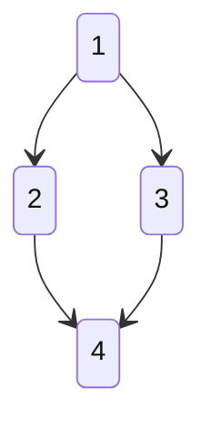
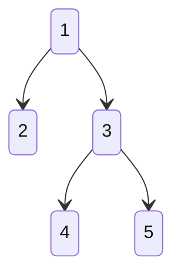

## Overview

Kubernetes (k8s) does not have the notion of a resource "depending on" on another k8s resource,
at least not in terms of the order in which these resources should be reconciled. Kubernetes
operators typically need to reconcile resources in order because these resources' state often
depends on the state of other resources or cannot be processed until these other resources reach
a given state or some condition holds true for them. Dealing with such scenarios are therefore
rather common for operators and the purpose of the workflow feature of the Java Operator SDK
(JOSDK) is to simplify supporting such cases in a declarative way. Workflows build on top of the
[dependent resources](https://javaoperatorsdk.io/docs/documentation/dependent-resource-and-workflows/dependent-resources/) feature.
While dependent resources focus on how a given secondary resource should be reconciled,
workflows focus on orchestrating how these dependent resources should be reconciled.

Workflows describe how as a set of
[dependent resources](https://javaoperatorsdk.io/docs/documentation/dependent-resource-and-workflows/dependent-resources/) (DR) depend on one
another, along with the conditions that need to hold true at certain stages of the
reconciliation process.

## Elements of Workflow

- **Dependent resource** (DR) - are the resources being managed in a given reconciliation logic.
- **Depends-on relation** - a `B` DR depends on another `A` DR if `B` needs to be reconciled
  after `A`.
- **Reconcile precondition** - is a condition on a given DR that needs to be become true before the
  DR is reconciled. This also allows to define optional resources that would, for example, only be
  created if a flag in a custom resource `.spec` has some specific value.
- **Ready postcondition** - is a condition on a given DR to prevent the workflow from
  proceeding until the condition checking whether the DR is ready holds true
- **Delete postcondition** - is a condition on a given DR to check if the reconciliation of
  dependents can proceed after the DR is supposed to have been deleted
- **Activation condition** - is a special condition meant to specify under which condition the DR is used in the
  workflow. A typical use-case for this feature is to only activate some dependents depending on the presence of
  optional resources / features on the target cluster. Without this activation condition, JOSDK would attempt to
  register an informer for these optional resources, which would cause an error in the case where the resource is
  missing. With this activation condition, you can now conditionally register informers depending on whether the
  condition holds or not. This is a very useful feature when your operator needs to handle different flavors of the
  platform (e.g. OpenShift vs plain Kubernetes) and/or change its behavior based on the availability of optional
  resources / features (e.g. CertManager, a specific Ingress controller, etc.).

  A generic activation condition is provided out of the box, called
  [CRDPresentActivationCondition](https://github.com/operator-framework/java-operator-sdk/blob/ba5e33527bf9e3ea0bd33025ccb35e677f9d44b4/operator-framework-core/src/main/java/io/javaoperatorsdk/operator/processing/dependent/workflow/CRDPresentActivationCondition.java)   
  that will prevent the associated dependent resource from being activated if the Custom Resource Definition associated
  with the dependent's resource type is not present on the cluster.
  See related [integration test](https://github.com/operator-framework/java-operator-sdk/blob/main/operator-framework/src/test/java/io/javaoperatorsdk/operator/workflow/crdpresentactivation).

  To have multiple resources of same type with an activation condition is a bit tricky, since you
  don't want to have multiple `InformerEventSource` for the same type, you have to explicitly 
  name the informer for the Dependent Resource (`@KubernetesDependent(informerConfig = @InformerConfig(name = "configMapInformer"))`)
  for all resource of same type with activation condition. This will make sure that only one is registered.
  See details at [low level api](https://github.com/operator-framework/java-operator-sdk/blob/main/operator-framework-core/src/main/java/io/javaoperatorsdk/operator/processing/event/EventSourceRetriever.java#L20-L52).

### Result conditions

While simple conditions are usually enough, it might happen you want to convey extra information as a result of the
evaluation of the conditions (e.g., to report error messages or because the result of the condition evaluation might be
interesting for other purposes). In this situation, you should implement `DetailedCondition` instead of `Condition` and
provide an implementation of the `detailedIsMet` method, which allows you to return a more detailed `Result` object via
which you can provide extra information. The `DetailedCondition.Result` interface provides factory method for your
convenience but you can also provide your own implementation if required.

You can access the results for conditions from the `WorkflowResult` instance that is returned whenever a workflow is
evaluated. You can access that result from the `ManagedWorkflowAndDependentResourceContext` accessible from the
reconciliation `Context`. You can then access individual condition results using the `
getDependentConditionResult` methods. You can see an example of this
in [this integration test](https://github.com/operator-framework/java-operator-sdk/blob/main/operator-framework/src/test/java/io/javaoperatorsdk/operator/workflow/workflowallfeature/WorkflowAllFeatureReconciler.java).

## Defining Workflows

Similarly to dependent resources, there are two ways to define workflows, in managed and standalone
manner.

### Managed

Annotations can be used to declaratively define a workflow for a `Reconciler`. Similarly to how
things are done for dependent resources, managed workflows execute before the `reconcile` method
is called. The result of the reconciliation can be accessed via the `Context` object that is
passed to the `reconcile` method.

The following sample shows a hypothetical use case to showcase all the elements: the primary
`TestCustomResource` resource handled by our `Reconciler` defines two dependent resources, a
`Deployment` and a `ConfigMap`. The `ConfigMap` depends on the `Deployment` so will be
reconciled after it. Moreover, the `Deployment` dependent resource defines a ready
post-condition, meaning that the `ConfigMap` will not be reconciled until the condition defined
by the `Deployment` becomes `true`. Additionally, the `ConfigMap` dependent also defines a
reconcile pre-condition, so it also won't be reconciled until that condition becomes `true`. The
`ConfigMap` also defines a delete post-condition, which means that the workflow implementation
will only consider the `ConfigMap` deleted until that post-condition becomes `true`.

```java

@Workflow(dependents = {
        @Dependent(name = DEPLOYMENT_NAME, type = DeploymentDependentResource.class,
                readyPostcondition = DeploymentReadyCondition.class),
        @Dependent(type = ConfigMapDependentResource.class,
                reconcilePrecondition = ConfigMapReconcileCondition.class,
                deletePostcondition = ConfigMapDeletePostCondition.class,
                activationCondition = ConfigMapActivationCondition.class,
                dependsOn = DEPLOYMENT_NAME)
})
@ControllerConfiguration
public class SampleWorkflowReconciler implements Reconciler<WorkflowAllFeatureCustomResource>,
    Cleaner<WorkflowAllFeatureCustomResource> {

  public static final String DEPLOYMENT_NAME = "deployment";

  @Override
  public UpdateControl<WorkflowAllFeatureCustomResource> reconcile(
      WorkflowAllFeatureCustomResource resource,
      Context<WorkflowAllFeatureCustomResource> context) {

    resource.getStatus()
        .setReady(
            context.managedWorkflowAndDependentResourceContext()  // accessing workflow reconciliation results
                .getWorkflowReconcileResult()
                .allDependentResourcesReady());
    return UpdateControl.patchStatus(resource);
  }

  @Override
  public DeleteControl cleanup(WorkflowAllFeatureCustomResource resource,
      Context<WorkflowAllFeatureCustomResource> context) {
    // emitted code

    return DeleteControl.defaultDelete();
  }
}

```

### Standalone

In this mode workflow is built manually
using [standalone dependent resources](https://javaoperatorsdk.io/docs/documentation/dependent-resource-and-workflows/dependent-resources/#standalone-dependent-resources)
. The workflow is created using a builder, that is explicitly called in the reconciler (from web
page sample):

```java

@ControllerConfiguration(
    labelSelector = WebPageDependentsWorkflowReconciler.DEPENDENT_RESOURCE_LABEL_SELECTOR)
public class WebPageDependentsWorkflowReconciler
    implements Reconciler<WebPage>, ErrorStatusHandler<WebPage> {

  public static final String DEPENDENT_RESOURCE_LABEL_SELECTOR = "!low-level";
  private static final Logger log =
      LoggerFactory.getLogger(WebPageDependentsWorkflowReconciler.class);

  private KubernetesDependentResource<ConfigMap, WebPage> configMapDR;
  private KubernetesDependentResource<Deployment, WebPage> deploymentDR;
  private KubernetesDependentResource<Service, WebPage> serviceDR;
  private KubernetesDependentResource<Ingress, WebPage> ingressDR;

  private final Workflow<WebPage> workflow;

  public WebPageDependentsWorkflowReconciler(KubernetesClient kubernetesClient) {
    initDependentResources(kubernetesClient);
    workflow = new WorkflowBuilder<WebPage>()
        .addDependentResource(configMapDR)
        .addDependentResource(deploymentDR)
        .addDependentResource(serviceDR)
        .addDependentResource(ingressDR).withReconcilePrecondition(new ExposedIngressCondition())
        .build();
  }

  @Override
  public Map<String, EventSource> prepareEventSources(EventSourceContext<WebPage> context) {
    return EventSourceUtils.nameEventSources(
        configMapDR.initEventSource(context),
        deploymentDR.initEventSource(context),
        serviceDR.initEventSource(context),
        ingressDR.initEventSource(context));
  }

  @Override
  public UpdateControl<WebPage> reconcile(WebPage webPage, Context<WebPage> context) {

    var result = workflow.reconcile(webPage, context);

    webPage.setStatus(createStatus(result));
    return UpdateControl.patchStatus(webPage);
  }
  // omitted code
}

```

## Workflow Execution

This section describes how a workflow is executed in details, how the ordering is determined and
how conditions and errors affect the behavior. The workflow execution is divided in two parts
similarly to how `Reconciler` and `Cleaner` behavior are separated.
[Cleanup](https://javaoperatorsdk.io/docs/documentation/reconciler/#implementing-a-reconciler-and-cleaner-interfaces) is
executed if a resource is marked for deletion.

## Common Principles

- **As complete as possible execution** - when a workflow is reconciled, it tries to reconcile as
  many resources as possible. Thus, if an error happens or a ready condition is not met for a
  resources, all the other independent resources will be still reconciled. This is the opposite
  to a fail-fast approach. The assumption is that eventually in this way the overall state will
  converge faster towards the desired state than would be the case if the reconciliation was
  aborted as soon as an error occurred.
- **Concurrent reconciliation of independent resources** - the resources which doesn't depend on
  others are processed concurrently. The level of concurrency is customizable, could be set to
  one if required. By default, workflows use the executor service
  from [ConfigurationService](https://github.com/java-operator-sdk/java-operator-sdk/blob/6f2a252952d3a91f6b0c3c38e5e6cc28f7c0f7b3/operator-framework-core/src/main/java/io/javaoperatorsdk/operator/api/config/ConfigurationService.java#L120-L120)

## Reconciliation

This section describes how a workflow is executed, considering first which rules apply, then
demonstrated using examples:

### Rules

1. A workflow is a Directed Acyclic Graph (DAG) build from the DRs and their associated
   `depends-on` relations.
2. Root nodes, i.e. nodes in the graph that do not depend on other nodes are reconciled first,
   in a parallel manner.
3. A DR is reconciled if it does not depend on any other DRs, or *ALL* the DRs it depends on are
   reconciled and ready. If a DR defines a reconcile pre-condition and/or an activation condition,
   then these condition must become `true` before the DR is reconciled.
4. A DR is considered *ready* if it got successfully reconciled and any ready post-condition it
   might define is `true`.
5. If a DR's reconcile pre-condition is not met, this DR is deleted. All the DRs that depend
   on the dependent resource are also recursively deleted. This implies that
   DRs are deleted in reverse order compared the one in which they are reconciled. The reason
   for this behavior is (Will make a more detailed blog post about the design decision, much deeper
   than the reference documentation)
   The reasoning behind this behavior is as follows: a DR with a reconcile pre-condition is only
   reconciled if the condition holds `true`. This means that if the condition is `false` and the
   resource didn't exist already, then the associated resource would not be created. To ensure
   idempotency (i.e. with the same input state, we should have the same output state), from this
   follows that if the condition doesn't hold `true` anymore, the associated resource needs to
   be deleted because the resource shouldn't exist/have been created.
6. If a DR's activation condition is not met, it won't be reconciled or deleted. If other DR's depend on it, those will
   be recursively deleted in a way similar to reconcile pre-conditions. Event sources for a dependent resource with
   activation condition are registered/de-registered dynamically, thus during the reconciliation.
7. For a DR to be deleted by a workflow, it needs to implement the `Deleter` interface, in which
   case its `delete` method will be called, unless it also implements the `GarbageCollected`
   interface. If a DR doesn't implement `Deleter` it is considered as automatically deleted. If
   a delete post-condition exists for this DR, it needs to become `true` for the workflow to
   consider the DR as successfully deleted.

### Samples

Notation: The arrows depicts reconciliation ordering, thus following the reverse direction of the  
`depends-on` relation:
`1 --> 2` mean `DR 2` depends-on `DR 1`.

#### Reconcile Sample




- Root nodes (i.e. nodes that don't depend on any others) are reconciled first. In this example,
  DR `1` is reconciled first since it doesn't depend on others.
  After that both DR `2` and `3` are reconciled concurrently, then DR `4` once both are
  reconciled successfully.
- If DR `2` had a ready condition and if it evaluated to as `false`, DR `4` would not be reconciled.
  However `1`,`2` and `3` would be.
- If `1` had a `false` ready condition, neither `2`,`3` or `4` would be reconciled.
- If `2`'s reconciliation resulted in an error, `4` would not be reconciled, but `3`
  would be (and `1` as well, of course).

#### Sample with Reconcile Precondition

 



- If `3` has a reconcile pre-condition that is not met, `1` and `2` would be reconciled. However,
  DR `3`,`4`,`5` would be deleted: `4` and `5` would be deleted concurrently but `3` would only
  be deleted if `4` and `5` were deleted successfully (i.e. without error) and all existing
  delete post-conditions were met.
- If `5` had a delete post-condition that was `false`, `3` would not be deleted but `4`
  would still be because they don't depend on one another.
- Similarly, if `5`'s deletion resulted in an error, `3` would not be deleted but `4` would be.

## Cleanup

Cleanup works identically as delete for resources in reconciliation in case reconcile pre-condition
is not met, just for the whole workflow.

### Rules

1. Delete is called on a DR if there is no DR that depends on it
2. If a DR has DRs that depend on it, it will only be deleted if all these DRs are successfully
   deleted without error and any delete post-condition is `true`.
3. A DR is "manually" deleted (i.e. it's `Deleter.delete` method is called) if it implements the
   `Deleter` interface but does not implement `GarbageCollected`. If a DR does not implement
   `Deleter` interface, it is considered as deleted automatically.

### Sample
 


- The DRs are deleted in the following order: `4` is deleted first, then `2` and `3` are deleted
  concurrently, and, only after both are successfully deleted,  `1` is deleted.
- If `2` had a delete post-condition that was `false`, `1` would not be deleted. `4` and `3`
  would be deleted.
- If `2` was in error, DR `1` would not be deleted. DR `4` and `3` would be deleted.
- if `4` was in error, no other DR would be deleted.

## Error Handling

As mentioned before if an error happens during a reconciliation, the reconciliation of other
dependent resources will still happen, assuming they don't depend on the one that failed. If
case multiple DRs fail, the workflow would throw an
['AggregatedOperatorException'](https://github.com/java-operator-sdk/java-operator-sdk/blob/86e5121d56ed4ecb3644f2bc8327166f4f7add72/operator-framework-core/src/main/java/io/javaoperatorsdk/operator/AggregatedOperatorException.java)
containing all the related exceptions.

The exceptions can be handled
by [`ErrorStatusHandler`](https://github.com/java-operator-sdk/java-operator-sdk/blob/14620657fcacc8254bb96b4293eded84c20ba685/operator-framework-core/src/main/java/io/javaoperatorsdk/operator/api/reconciler/ErrorStatusHandler.java)

## Waiting for the actual deletion of Kubernetes Dependent Resources

Let's consider a case when a Kubernetes Dependent Resources (KDR) depends on another resource, on cleanup
the resources will be deleted in reverse order, thus the KDR will be deleted first.
However, the workflow implementation currently simply asks the Kubernetes API server to delete the resource. This is,
however, an asynchronous process, meaning that the deletion might not occur immediately, in particular if the resource
uses finalizers that block the deletion or if the deletion itself takes some time. From the SDK's perspective, though,
the deletion has been requested and it moves on to other tasks without waiting for the resource to be actually deleted
from the server (which might never occur if it uses finalizers which are not removed).
In situations like these, if your logic depends on resources being actually removed from the cluster before a
cleanup workflow can proceed correctly, you need to block the workflow progression using a delete post-condition that
checks that the resource is actually removed or that it, at least, doesn't have any finalizers any longer. JOSDK
provides such a delete post-condition implementation in the form of
[`KubernetesResourceDeletedCondition`](https://github.com/java-operator-sdk/java-operator-sdk/blob/main/operator-framework-core/src/main/java/io/javaoperatorsdk/operator/processing/dependent/workflow/KubernetesResourceDeletedCondition.java)

Also, check usage in an [integration test](https://github.com/operator-framework/java-operator-sdk/blob/main/operator-framework/src/test/java/io/javaoperatorsdk/operator/workflow/manageddependentdeletecondition/ManagedDependentDefaultDeleteConditionReconciler.java).

In such cases the Kubernetes Dependent Resource should extend `CRUDNoGCKubernetesDependentResource`
and NOT `CRUDKubernetesDependentResource` since otherwise the Kubernetes Garbage Collector would delete the resources.
In other words if a Kubernetes Dependent Resource depends on another dependent resource, it should not implement
`GargageCollected` interface, otherwise the deletion order won't be guaranteed.


## Explicit Managed Workflow Invocation

Managed workflows, i.e. ones that are declared via annotations and therefore completely managed by JOSDK, are reconciled
before the primary resource. Each dependent resource that can be reconciled (according to the workflow configuration)
will therefore be reconciled before the primary reconciler is called to reconcile the primary resource. There are,
however, situations where it would be be useful to perform additional steps before the workflow is reconciled, for
example to validate the current state, execute arbitrary logic or even skip reconciliation altogether. Explicit
invocation of managed workflow was therefore introduced to solve these issues.

To use this feature, you need to set the `explicitInvocation` field to `true` on the `@Workflow` annotation and then
call the `reconcileManagedWorkflow` method from the `
ManagedWorkflowAndDependentResourceContext` retrieved from the reconciliation `Context` provided as part of your primary
resource reconciler `reconcile` method arguments.

See
related [integration test](https://github.com/operator-framework/java-operator-sdk/blob/main/operator-framework/src/test/java/io/javaoperatorsdk/operator/workflow/workflowexplicitinvocation)
for more details.

For `cleanup`, if the `Cleaner` interface is implemented, the `cleanupManageWorkflow()` needs to be called explicitly.
However, if `Cleaner` interface is not implemented, it will be called implicitly.
See
related [integration test](https://github.com/operator-framework/java-operator-sdk/tree/main/operator-framework/src/test/java/io/javaoperatorsdk/operator/workflow/workflowexplicitcleanup).

While nothing prevents calling the workflow multiple times in a reconciler, it isn't typical or even recommended to do
so. Conversely, if explicit invocation is requested but `reconcileManagedWorkflow` is not called in the primary resource
reconciler, the workflow won't be reconciled at all.

## Notes and Caveats

- Delete is almost always called on every resource during the cleanup. However, it might be the case
  that the resources were already deleted in a previous run, or not even created. This should
  not be a problem, since dependent resources usually cache the state of the resource, so are
  already aware that the resource does not exist and that nothing needs to be done if delete is
  called.
- If a resource has owner references, it will be automatically deleted by the Kubernetes garbage
  collector if the owner resource is marked for deletion. This might not be desirable, to make
  sure that delete is handled by the workflow don't use garbage collected kubernetes dependent
  resource, use for
  example [`CRUDNoGCKubernetesDependentResource`](https://github.com/java-operator-sdk/java-operator-sdk/blob/86e5121d56ed4ecb3644f2bc8327166f4f7add72/operator-framework-core/src/main/java/io/javaoperatorsdk/operator/processing/dependent/kubernetes/CRUDNoGCKubernetesDependentResource.java)
  .
- No state is persisted regarding the workflow execution. Every reconciliation causes all the
  resources to be reconciled again, in other words the whole workflow is again evaluated.

