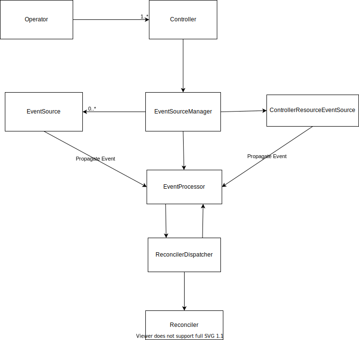

# Architecture and Internals

This document gives an overview of the internal structure and components of Java Operator SDK core, in order to make it
easier for developers to understand and contribute to it. However, this is just an extract of the backbone of the core
module, but other parts should be fairly easy to understand. We will maintain this document on developer feedback.

## The Big Picture and Core Components

[Operator](https://github.com/java-operator-sdk/java-operator-sdk/blob/main/operator-framework-core/src/main/java/io/javaoperatorsdk/operator/Operator.java)
is a set of
independent [controllers](https://github.com/java-operator-sdk/java-operator-sdk/blob/main/operator-framework-core/src/main/java/io/javaoperatorsdk/operator/processing/Controller.java)
. Controller however, is an internal class managed by the framework itself. It encapsulates directly or indirectly all
the processing units for a single custom resource. Other components:

- [EventSourceManager](https://github.com/java-operator-sdk/java-operator-sdk/blob/main/operator-framework-core/src/main/java/io/javaoperatorsdk/operator/processing/event/EventSourceManager.java)
  aggregates all the event sources regarding a controller. Provides starts and stops the event sources.
- [ControllerResourceEventSource](https://github.com/java-operator-sdk/java-operator-sdk/blob/main/operator-framework-core/src/main/java/io/javaoperatorsdk/operator/processing/event/source/controller/ControllerResourceEventSource.java)
  is a central event source that watches the controller related custom resource for changes, propagates events and caches the
  state of the custom resources. In the background from V2 it uses Informers.
- [EventProcessor](https://github.com/java-operator-sdk/java-operator-sdk/blob/main/operator-framework-core/src/main/java/io/javaoperatorsdk/operator/processing/event/EventProcessor.java)
  processes the incoming events. Implements execution serialization. Manages the executor service for execution. Also implements the post-processing
  of after the reconciler was executed, like re-schedules and retries of events.  
- [ReconcilerDispatcher](https://github.com/java-operator-sdk/java-operator-sdk/blob/main/operator-framework-core/src/main/java/io/javaoperatorsdk/operator/processing/event/ReconciliationDispatcher.java)
  is responsible for managing logic around reconciler execution, deciding which method should be called of the reconciler, managing the result
  (UpdateControl and DeleteControl), making the instructed Kubernetes API calls. 
- [Reconciler](https://github.com/java-operator-sdk/java-operator-sdk/blob/main/operator-framework-core/src/main/java/io/javaoperatorsdk/operator/api/reconciler/Reconciler.java)
  is the primary entry-point for the developers of the framework to implement the reconciliation logic.

## Typical Workflow

A typical workflows looks like following:
1. An EventSource produces and event, that is propagated to the event processor.
2. In the event processor the related `CustomResource` is read from the cache based on the `ResourceID` in the event. 
3. If there is no other execution running for the custom resource, an execution is submitted for the executor (thread pool) .
4. Executor call EventDispatcher what decides which method to execute of the reconciler. Let's say in this case it was `reconcile(...)`
5. After reconciler execution the Dispatcher calls Kubernetes API server, since the `reconcile` method returned with `UpdateControl.updateStatus(...)` result.
6. Now the dispatcher finishes the execution and calls back `EventProcessor` to finalize the execution. 
7. EventProcessor checks if there is no `reschedule` or `retry` required and if there are no subsequent events received for the custom resource
8. Neither of this happened, therefore the event execution finished.
