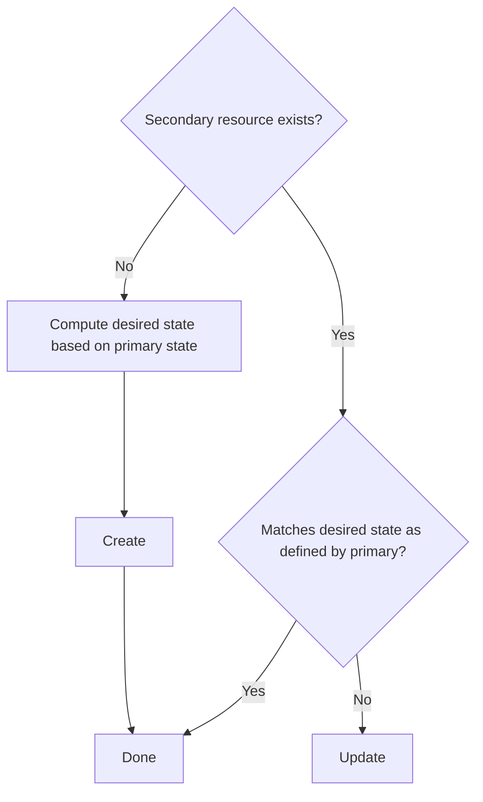

# Dependent Resources

DISCLAIMER: The Dependent Resource support is relatively new and, while we strove to cover what we
anticipate will be the most common use cases, the implementation is not simple and might still
evolve. As a result, some APIs could be still a subject of change in the future. However,
non-backwards compatible changes are expected to be trivial to adapt to.

## Motivations and Goals

Most operators need to deal with secondary resources when trying to realize the desired state
described by the primary resource it is in charge of. For example, the Kubernetes-native
`Deployment` controller needs to manage `ReplicaSet` instances as part of a `Deployment`'s
reconciliation process. In this instance, `ReplicatSet` is considered a secondary resource for
the `Deployment` controller.

Controllers that deal with secondary resources typically need to perform the following steps, for
each secondary resource:

As this process is pretty much similar for each dependent resource, it makes sense for the SDK to
offer some level of support for these repetitive actions to remove the boilerplate code. While these
steps are not difficult in and of themselves, there are some subtleties that can lead to bugs or
sub-optimal code if not done right. It should be possible to handle common cases (such as dealing
with Kubernetes-native secondary resources) in a semi-declarative way with only a minimal amount of
code, JOSDK taking care of wiring everything accordingly.

Moreover, in order for your reconciler to get informed of events on these secondary resources, you
need to configure and create event sources and maintain them. JOSDK already makes it rather easy to
deal with these but we felt that we could make things even simpler.

Finally, there are also opportunities for the SDK to transparently add features that are even
trickier to get right, such as immediate caching of updated or created resources (so that your
reconciler doesn't need to wait for a cluster roundtrip to continue its work) and associated event
filtering (so that something your reconciler just changed doesn't re-trigger a reconciliation, for
example).

## Design

### `DependentResource` vs. `AbstractDependentResource`

The new `DependentResource` interface lies at the core of the design and strives to encapsulate the
logic that is required to reconcile the state of the associated secondary resource based on the
state of the primary one. For most cases, this logic will follow the flow expressed above and JOSDK
provides a very convenient implementation of this logic in the form of the
`AbstractDependentResource` class. If your logic doesn't fit this pattern, though, you can still
provide your own `reconcile` method implementation. While the benefits of using dependent resources
are less obvious in that case, this allows you to separate the logic necessary to deal with each
secondary resource in its own class that can then be tested in isolation via unit tests. You can
also use the declarative support with your own implementations as we shall see later on.

`AbstractDependentResource` is designed so that classes extending it specify which functionality
they support by implementing trait interfaces. This design has been selected to express the fact
that not all secondary resources are completely under the control of the primary reconciler: some
dependent resources are only ever created or updated for example and we needed a way to let JOSDK
when that is the case. We therefore provide trait interfaces: `Creator`,
`Updater` and `Deleter` to express that the `DependentResource` implementation will provide custom
functionality to create, update and delete its associated secondary resources, respectively. If
these traits are not implemented then parts of the logic described above is never triggered: if your
implementation doesn't implement `Creator`, for example,
`AbstractDependentResource` will never try to create the associated secondary resource, even if it
doesn't exist. It is thus possible to create read-only dependent resources that will trigger your
reconciler whenever a user interacts with them but that are never modified by your reconciler
itself.

### Batteries included: convenient `DependentResource` implementations!

JOSDK also offers several other convenient implementations building on top of
`AbstractDependentResource` that you can use as starting points for your own implementations.

One such implementation is the `KubernetesDependentResource` class that makes it really easy to work
with Kubernetes-native resources as, in this case, you usually only need to provide an
implementation for the `desired` method to tell JOSDK what the desired state of your secondary
resource should be based on the specified primary resource state. JOSDK takes care of everything
else using default implementations that you can override in case you need more precise control of
what's going on.

We also provide implementations that makes it very easy to cache
(`AbstractCachingDependentResource`) or make it easy to poll for changes in external
resources (`PollingDependentResource`, `PerResourcePollingDependentResource`).

FIX-ME: the following currently isn't true but we should put all in the same package hierarchy, see
https://github.com/java-operator-sdk/java-operator-sdk/issues/1049
All the provided implementations can be found in
the `io/javaoperatorsdk/operator/processing/dependent` package.

## Managed Dependent Resources

As mentioned previously, one goal of this implementation is to make it possible to
semi-declaratively create and wire dependent resources. You can annotate your reconciler with
`@Dependent` annotations that specify which `DependentResource` implementation it depends upon and
JOSDK will take the appropriate steps to wire everything thing together and call your
`DependentResource` implementations `reconcile` method before your primary resource is reconciled.
This makes sense in most use cases where the logic associated with the primary resource is usually
limited to status handling based on the state of the secondary resources. This behavior and
automated handling is referred to as "managed" because the `DependentResource`
implementations are managed by JOSDK.

## Standalone Dependent Resources

## Other Dependent Resources features