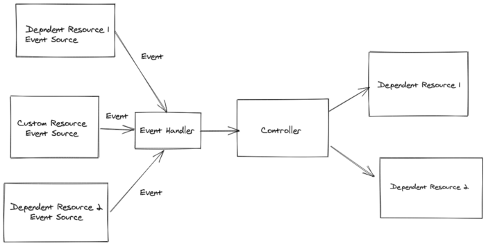

# Features

Java Operator SDK is a high level framework and related tooling in order to facilitate implementation of Kubernetes
operators. The features are by default following the best practices in an opinionated way. However, feature flags and
other configuration options are provided to fine tune or turn off these features.

## Reconciliation Execution in a Nutshell

Reconciliation execution is always triggered by an event. Events typically come from the custom resource
(i.e. custom resource is created, updated or deleted) that the controller is watching, but also from different sources
(see event sources). When an event is received reconciliation is executed, unless there is already a reconciliation
happening for a particular custom resource. In other words it is guaranteed by the framework that no concurrent
reconciliation happens for a custom resource.

After a reconciliation (
i.e. [Reconciler](https://github.com/java-operator-sdk/java-operator-sdk/blob/main/operator-framework-core/src/main/java/io/javaoperatorsdk/operator/api/reconciler/Reconciler.java)
called, a post-processing phase follows, where typically framework checks if:

- an exception was thrown during execution, if yes schedules a retry.
- there are new events received during the controller execution, if yes schedule the execution again.
- there is an instruction to re-schedule the execution for the future, if yes schedules a timer event with the specified
  delay.
- if none above, the reconciliation is finished.

Briefly, in the hearth of the execution is an eventing system, where events are the triggers of the reconciliation
execution.

## Finalizer Support

[Kubernetes finalizers](https://kubernetes.io/docs/concepts/overview/working-with-objects/finalizers/)
make sure that a reconciliation happens when a custom resource is instructed to be deleted. Typical case when it's
useful, when an operator is down (pod not running). Without a finalizer the reconciliation - thus the cleanup -
i.e. [`Cleaner.cleanup(...)`](https://github.com/java-operator-sdk/java-operator-sdk/blob/main/operator-framework-core/src/main/java/io/javaoperatorsdk/operator/api/reconciler/Cleaner.java#L28)
would not happen if a custom resource is deleted.

To use finalizers the reconciler have to implement [`Cleaner<P>`](https://github.com/java-operator-sdk/java-operator-sdk/blob/main/operator-framework-core/src/main/java/io/javaoperatorsdk/operator/api/reconciler/Cleaner.java) interface.
In other words, finalizer is added only if the `Reconciler` implements `Cleaner` interface. If not, no
finalizer is added and/or removed.

Finalizers are automatically added by the framework as the first step, thus after a custom resource is created, but
before the first reconciliation. The finalizer is added via a separate Kubernetes API call. As a result of this update,
the finalizer will be present. The subsequent event will be received, which will trigger the first reconciliation.

The finalizer that is automatically added will be also removed after the `cleanup` is executed on the reconciler.
However, the removal behaviour can be further customized, and can be instructed to "not remove yet" - this is useful just
in some specific corner cases, when there would be a long waiting period for some dependent resource cleanup.

The name of the finalizers can be specified, in case it is not, a name will be generated.

See [`@ControllerConfiguration`](https://github.com/java-operator-sdk/java-operator-sdk/blob/main/operator-framework-core/src/main/java/io/javaoperatorsdk/operator/api/reconciler/ControllerConfiguration.java)
annotation for more details.

### When not to Use Finalizers?

Typically, automated finalizer handling should be turned off, in case the cleanup of **all** the dependent resources is
handled by Kubernetes itself. This is handled by
Kubernetes [garbage collection](https://kubernetes.io/docs/concepts/architecture/garbage-collection/#owners-dependents).
Setting the owner reference and related fields are not in the scope of the SDK, it's up to the user to have them set
properly when creating the objects.

When automatic finalizer handling is turned off, the `Reconciler.cleanup(...)` method is not called at all. Not even in
case when a delete event received. So it does not make sense to implement this method and turn off finalizer at the same
time.

## The [`reconcile`](https://github.com/java-operator-sdk/java-operator-sdk/blob/main/operator-framework-core/src/main/java/io/javaoperatorsdk/operator/api/reconciler/Reconciler.java#L16) and [`cleanup`](https://github.com/java-operator-sdk/java-operator-sdk/blob/main/operator-framework-core/src/main/java/io/javaoperatorsdk/operator/api/reconciler/Cleaner.java#L28)

The lifecycle of a custom resource can be clearly separated into two phases from the perspective of an operator. When a
custom resource is created or update, or on the other hand when the custom resource is deleted - or rather marked for
deletion in case a finalizer is used.

This separation-related logic is automatically handled by the framework. The framework will always call `reconcile`
method, unless the custom resource is
[marked from deletion](https://kubernetes.io/docs/concepts/overview/working-with-objects/finalizers/#how-finalizers-work)
. From the point when the custom resource is marked from deletion, only the `cleanup` method is called, of course 
only if the reconciler implements the `Cleaner` interface.

### Using [`UpdateControl`](https://github.com/java-operator-sdk/java-operator-sdk/blob/main/operator-framework-core/src/main/java/io/javaoperatorsdk/operator/api/reconciler/UpdateControl.java) and [`DeleteControl`](https://github.com/java-operator-sdk/java-operator-sdk/blob/main/operator-framework-core/src/main/java/io/javaoperatorsdk/operator/api/reconciler/DeleteControl.java)

These two classes are used to control the outcome or the desired behaviour after the reconciliation.

The `UpdateControl` can instruct the framework to update the status sub-resource of the resource and/or re-schedule a
reconciliation with a desired time delay.

```java 
  @Override
  public UpdateControl<MyCustomResource> reconcile(
     EventSourceTestCustomResource resource, Context context) {
    ...
    return UpdateControl.updateStatus(resource).rescheduleAfter(10, TimeUnit.SECONDS);
  }
```

without an update:

```java 
  @Override
  public UpdateControl<MyCustomResource> reconcile(
     EventSourceTestCustomResource resource, Context context) {
    ...
    return UpdateControl.<MyCustomResource>noUpdate().rescheduleAfter(10, TimeUnit.SECONDS);
  }
```

Note, that it's not always desirable to always schedule a retry, rather to use `EventSources` to trigger the
reconciliation.

Those are the typical use cases of resource updates, however in some cases there it can happen that the controller wants
to update the custom resource itself (like adding annotations) or not to do any updates, which is also supported.

It is also possible to update both the status and the custom resource with the `updateCustomResourceAndStatus` method. In
this case first the custom resource is updated then the status in two separate requests to K8S API.

Always update the custom resource with `UpdateControl`, not with the actual kubernetes client if possible.

On resource updates there is always an optimistic version control in place, to make sure that another update is not
overwritten (by setting `resourceVersion` ) .

The `DeleteControl` typically instructs the framework to remove the finalizer after the dependent resource are cleaned
up in `cleanup` implementation.

```java

public DeleteControl cleanup(MyCustomResource customResource, Context context) {
    ...
    return DeleteControl.defaultDelete();
}

```

However, there is a possibility to not remove the finalizer, this allows to clean up the resources in a more async way,
mostly for the cases when there is a long waiting period after a delete operation is initiated. Note that in this case
you might want to either schedule a timed event to make sure
`cleanup` is executed again or use event sources to get notified about the state changes of a deleted resource.

## Automatic Observed Generation Handling

Having `.observedGeneration` value on the status of the resource is a best practice to indicate the last generation of
the resource reconciled successfully by the controller. This helps the users / administrators to check if the custom
resource was reconciled.

In order to have this feature working:

- the **status class** (not the resource) must implement the
  [`ObservedGenerationAware`](https://github.com/java-operator-sdk/java-operator-sdk/blob/main/operator-framework-core/src/main/java/io/javaoperatorsdk/operator/api/ObservedGenerationAware.java)
  interface. See also
  the [`ObservedGenerationAwareStatus`](https://github.com/java-operator-sdk/java-operator-sdk/blob/main/operator-framework-core/src/main/java/io/javaoperatorsdk/operator/api/ObservedGenerationAwareStatus.java)
  which can also be extended.
- The other condition is that the `CustomResource.getStatus()` method should not return `null`
  , but an instance of the class representing `status`. The best way to achieve this is to
  override [`CustomResource.initStatus()`](https://github.com/fabric8io/kubernetes-client/blob/865e0ddf67b99f954aa55ab14e5806d53ae149ec/kubernetes-client/src/main/java/io/fabric8/kubernetes/client/CustomResource.java#L139)
  .

If these conditions are fulfilled and generation awareness not turned off, the observed generation is automatically set
by the framework after the `reconcile` method is called. Note that the observed generation is updated also
when `UpdateControl.noUpdate()` is returned from the reconciler. See this feature working in
the [WebPage example](https://github.com/java-operator-sdk/java-operator-sdk/blob/main/sample-operators/webpage/src/main/java/io/javaoperatorsdk/operator/sample/WebPageStatus.java#L5)
.

```java
public class WebPageStatus extends ObservedGenerationAwareStatus {

    private String htmlConfigMap;
  
  ...
}
```

Initializing status on custom resource:

```java 
@Group("sample.javaoperatorsdk")
@Version("v1")
public class WebPage extends CustomResource<WebPageSpec, WebPageStatus>
    implements Namespaced {

  @Override
  protected WebPageStatus initStatus() {
    return new WebPageStatus();
  }
}
```

## Generation Awareness and Event Filtering

On an operator startup, the best practice is to reconcile all the resources. Since while operator was down, changes
might have made both to custom resource and dependent resources. 

When the first reconciliation is done successfully, the next reconciliation is triggered if either the dependent 
resources are changed or the custom resource `.spec` is changed. If other fields like `.metadata` is changed on the 
custom resource, the reconciliation could be skipped. This is supported out of the box, thus the reconciliation by 
default is not triggered if the change to the main custom resource does not increase the `.metadata.generation` field.
Note that the increase of `.metada.generation`  is handled automatically by Kubernetes.

To turn off this feature set `generationAwareEventProcessing` to `false` for the `Reconciler`.

## Support for Well Known (non-custom) Kubernetes Resources

A Controller can be registered for a non-custom resource, so well known Kubernetes resources like (
Ingress,Deployment,...). Note that automatic observed generation handling is not supported for these resources. Although
in case adding a secondary controller for well known k8s resource, probably the observed generation should be handled by
the primary controller.

See
the [integration test](https://github.com/java-operator-sdk/java-operator-sdk/blob/main/operator-framework/src/test/java/io/javaoperatorsdk/operator/sample/deployment/DeploymentReconciler.java)
for reconciling deployments.

```java 
public class DeploymentReconciler
    implements Reconciler<Deployment>, TestExecutionInfoProvider {

  @Override
  public UpdateControl<Deployment> reconcile(
      Deployment resource, Context context) {
  ...
  }
```

## Max Interval Between Reconciliations

In case informers are all in place and reconciler is implemented correctly, there is no need for additional triggers. 
However, it's a [common practice](https://github.com/java-operator-sdk/java-operator-sdk/issues/848#issuecomment-1016419966) 
to have a failsafe periodic trigger in place,
just to make sure the resources are reconciled after certain time. This functionality is in place by default, there
is quite high interval (currently 10 hours) while the reconciliation is triggered. See how to override this using 
the standard annotation:

```java
@ControllerConfiguration(finalizerName = NO_FINALIZER,
        reconciliationMaxInterval = @ReconciliationMaxInterval(
                interval = 50,
                timeUnit = TimeUnit.MILLISECONDS))
```

The event is not propagated in a fixed rate, rather it's scheduled after each reconciliation. So the 
next reconciliation will after at most within the specified interval after last reconciliation.

This feature can be turned off by setting `reconciliationMaxInterval` to [`Constants.NO_RECONCILIATION_MAX_INTERVAL`](https://github.com/java-operator-sdk/java-operator-sdk/blob/442e7d8718e992a36880e42bd0a5c01affaec9df/operator-framework-core/src/main/java/io/javaoperatorsdk/operator/api/reconciler/Constants.java#L8-L8)
or any non-positive number.

The automatic retries are not affected by this feature, in case of an error no schedule is set by this feature. 

## Automatic Retries on Error

When an exception is thrown from a controller, the framework will schedule an automatic retry of the reconciliation. The
retry is behavior is configurable, an implementation is provided that should cover most of the use-cases, see
[GenericRetry](https://github.com/java-operator-sdk/java-operator-sdk/blob/master/operator-framework-core/src/main/java/io/javaoperatorsdk/operator/processing/retry/GenericRetry.java)
. But it is possible to provide a custom implementation.

It is possible to set a limit on the number of retries. In
the [Context](https://github.com/java-operator-sdk/java-operator-sdk/blob/master/operator-framework-core/src/main/java/io/javaoperatorsdk/operator/api/Context.java)
object information is provided about the retry, particularly interesting is the `isLastAttempt`, since a different
behavior could be implemented based on this flag. Like setting an error message in the status in case of a last attempt;

```java
    GenericRetry.defaultLimitedExponentialRetry()
        .setInitialInterval(5000)
        .setIntervalMultiplier(1.5D)
        .setMaxAttempts(5);
```

Event if the retry reached a limit, in case of a new event is received the reconciliation would happen again, it's just
won't be a result of a retry, but the new event. However, in case of an error happens also in this case, it won't
schedule a retry is at this point the retry limit is already reached.

A successful execution resets the retry.

### Setting Error Status After Last Retry Attempt

In order to facilitate error reporting Reconciler can implement the following
[interface](https://github.com/java-operator-sdk/java-operator-sdk/blob/main/operator-framework-core/src/main/java/io/javaoperatorsdk/operator/api/reconciler/ErrorStatusHandler.java):

```java
public interface ErrorStatusHandler<P extends HasMetadata> {

    ErrorStatusUpdateControl<P> updateErrorStatus(P resource, Context<P> context, Exception e);

}
```

The `updateErrorStatus` method is called in case an exception is thrown from the reconciler. It is also called when
there is no retry configured, just after the reconciler execution. In the first call the `RetryInfo.getAttemptCount()`
is always zero, since it is not a result of a retry
(regardless if retry is configured or not).

The result of the method call is used to make a status update on the custom resource. This is always a sub-resource
update request, so no update on custom resource itself (like spec of metadata) happens. Note that this update request
will also produce an event, and will result in a reconciliation if the controller is not generation aware.

The scope of this feature is only the `reconcile` method of the reconciler, since there should not be updates on custom
resource after it is marked for deletion.

Retry can be skipped for the cases of unrecoverable errors:

```java
 ErrorStatusUpdateControl.updateStatus(customResource).withNoRetry();
```

### Correctness and Automatic Retries

There is a possibility to turn off the automatic retries. This is not desirable, unless there is a very specific reason.
Errors naturally happen, typically network errors can cause some temporal issues, another case is when a custom resource
is updated during the reconciliation (using `kubectl` for example), in this case if an update of the custom resource
from the controller (using `UpdateControl`) would fail on a conflict. The automatic retries covers these cases and will
result in a reconciliation, even if normally an event would not be processed as a result of a custom resource update
from previous example (like if there is no generation update as a result of the change and generation filtering is
turned on)

## Retry and Rescheduling and Event Handling Common Behavior

Retry, reschedule and standard event processing forms a relatively complex system, where these functionalities are not
independent of each other. In the following we describe the behavior in this section, so it is easier to understand the
intersections:

1. A successful execution resets a retry and the rescheduled executions which were present before the reconciliation.
   However, a new rescheduling can be instructed from the reconciliation outcome (`UpdateControl` or `DeleteControl`).
2. In case an exception happened, and a retry is initiated, but an event received meanwhile, then reconciliation will be
   executed instantly, and this execution won't count as a retry attempt.
3. If the retry limit is reached (so no more automatic retry would happen), but a new event received, the reconciliation
   will still happen, but won't reset the retry, will be still marked as the last attempt in the retry info. The point
   (1) still holds, but in case of an error, no retry will happen.

## Handling Related Events with Event Sources

See also this [blog post](https://csviri.medium.com/java-operator-sdk-introduction-to-event-sources-a1aab5af4b7b).

Event sources are a relatively simple yet powerful and extensible concept to trigger controller executions. Usually
based on changes of dependent resources. To solve the mentioned problems above, de-facto we watch resources we manage
for changes, and reconcile the state if a resource is changed. Note that resources we are watching can be Kubernetes and
also non-Kubernetes objects. Typically, in case of non-Kubernetes objects or services we can extend our operator to
handle webhooks or websockets or to react to any event coming from a service we interact with. What happens is when we
create a dependent resource we also register an Event Source that will propagate events regarding the changes of that
resource. This way we avoid the need of polling, and can implement controllers very efficiently.



There are few interesting points here:
The CustomResourceEvenSource event source is a special one, which sends events regarding changes of our custom resource,
this is an event source which is always registered for every controller by default. An event is always related to a
custom resource. Concurrency is still handled for you, thus we still guarantee that there is no concurrent execution of
the controller for the same custom resource (
there is parallel execution if an event is related to another custom resource instance).

### Caching and Event Sources

Typically, when we work with Kubernetes (but possibly with others), we manage the objects in a declarative way. This is
true also for Event Sources. For example if we watch for changes of a Kubernetes Deployment object in the
InformerEventSource, we always receive the whole object from the Kubernetes API. Later when we try to reconcile in the
controller (not using events) we would like to check the state of this deployment (but also other dependent resources),
we could read the object again from Kubernetes API. However since we watch for the changes, we know that we always
receive the most up-to-date version in the Event Source. So naturally, what we can do is cache the latest received
objects (in the Event Source) and read it from there if needed. This is the preferred way, since it reduces the number
of requests to Kubernetes API server, and leads to faster reconciliation cycles.

Note that when an operator starts and the first reconciliation is executed the caches are already populated for example  
for `InformerEventSource`. Currently, this is not true however for `PerResourceEventSource`, where the cache might or 
might not be populated. To handle this situation elegantly methods are provided which checks the object in cache, if
not found tries to get it from the supplier. See related [method](https://github.com/java-operator-sdk/java-operator-sdk/blob/main/operator-framework-core/src/main/java/io/javaoperatorsdk/operator/processing/event/source/polling/PerResourcePollingEventSource.java#L146)
.

### Registering Event Sources

To register event sources `Reconciler` has to
implement [`EventSourceInitializer`](https://github.com/java-operator-sdk/java-operator-sdk/blob/main/operator-framework-core/src/main/java/io/javaoperatorsdk/operator/api/reconciler/EventSourceInitializer.java)
interface and init a list of event sources to register. The easiest way to see it is
on [tomcat example](https://github.com/java-operator-sdk/java-operator-sdk/blob/main/sample-operators/tomcat-operator/src/main/java/io/javaoperatorsdk/operator/sample/TomcatReconciler.java)
(irrelevant details omitted):

```java

@ControllerConfiguration
public class TomcatReconciler implements Reconciler<Tomcat>, EventSourceInitializer<Tomcat> {

    @Override
    public List<EventSource> prepareEventSources(EventSourceContext<Tomcat> context) {
        SharedIndexInformer<Deployment> deploymentInformer =
                kubernetesClient.apps()
                        .deployments()
                        .inAnyNamespace()
                        .withLabel("app.kubernetes.io/managed-by", "tomcat-operator")
                        .runnableInformer(0);

        return List.of(
                new InformerEventSource<>(deploymentInformer, d -> {
                    var ownerReferences = d.getMetadata().getOwnerReferences();
                    if (!ownerReferences.isEmpty()) {
                        return Set.of(new ResourceID(ownerReferences.get(0).getName(), d.getMetadata().getNamespace()));
                    } else {
                        return EMPTY_SET;
                    }
                }));
    }
  ...
}
```

In the example above an `InformerEventSource` is registered (more on this specific eventsource later). Multiple things
are going on here:

1. An `SharedIndexInformer` (class from fabric8 Kubernetes client) is created. This will watch and produce events for
   `Deployments` in every namespace, but will filter them based on label. So `Deployments` which are not managed by
   `tomcat-operator` (the label is not present on them) will not trigger a reconciliation.
2. In the next step
   an [InformerEventSource](https://github.com/java-operator-sdk/java-operator-sdk/blob/main/operator-framework-core/src/main/java/io/javaoperatorsdk/operator/processing/event/source/informer/InformerEventSource.java)
   is created, which wraps the `SharedIndexInformer`. In addition to that a mapping functions is provided, **this maps
   the event of the watched resource (in this case `Deployment`) to the custom resources to reconcile**. Not that in
   this case this is a simple task, since `Deployment` is already created with an owner reference. Therefore,
   the `ResourceID`
   what identifies the custom resource to reconcile is created from the owner reference. 

Note that a set of `ResourceID` is returned, this is usually just a set with one element. The possibility to specify
multiple values are there to cover some rare corner cases. If an irrelevant resource is observed, an empty set can 
be returned to not reconcile any custom resource.

### Built-in EventSources

There are multiple event-sources provided out of the box, the following are some more central ones:

1. [InformerEventSource](https://github.com/java-operator-sdk/java-operator-sdk/blob/main/operator-framework-core/src/main/java/io/javaoperatorsdk/operator/processing/event/source/informer/InformerEventSource.java) -
   is there to cover events for all Kubernetes resources. Provides also a cache to use during the reconciliation.
   Basically no other event source required to watch Kubernetes resources.
2. [PerResourcePollingEventSource](https://github.com/java-operator-sdk/java-operator-sdk/blob/main/operator-framework-core/src/main/java/io/javaoperatorsdk/operator/processing/event/source/polling/PerResourcePollingEventSource.java) -
   is used to poll external API, which don't support webhooks or other event notifications. It extends the abstract
   [CachingEventSource](https://github.com/java-operator-sdk/java-operator-sdk/blob/main/operator-framework-core/src/main/java/io/javaoperatorsdk/operator/processing/event/source/CachingEventSource.java)
   to support caching. See [MySQL Schema sample](https://github.com/java-operator-sdk/java-operator-sdk/blob/main/sample-operators/mysql-schema/src/main/java/io/javaoperatorsdk/operator/sample/MySQLSchemaReconciler.java) for usage.
3. [PollingEventSource](https://github.com/java-operator-sdk/java-operator-sdk/blob/main/operator-framework-core/src/main/java/io/javaoperatorsdk/operator/processing/event/source/polling/PollingEventSource.java)
   is similar to `PerResourceCachingEventSource` only it not polls a specific API separately per custom resource, but 
   periodically and independently of actually observed custom resources.  
5. [SimpleInboundEventSource](https://github.com/java-operator-sdk/java-operator-sdk/blob/main/operator-framework-core/src/main/java/io/javaoperatorsdk/operator/processing/event/source/inbound/SimpleInboundEventSource.java)
   and [CachingInboundEventSource](https://github.com/java-operator-sdk/java-operator-sdk/blob/main/operator-framework-core/src/main/java/io/javaoperatorsdk/operator/processing/event/source/inbound/CachingInboundEventSource.java) 
   is used to handle incoming events from webhooks and messaging systems.  
6. [ControllerResourceEventSource](https://github.com/java-operator-sdk/java-operator-sdk/blob/main/operator-framework-core/src/main/java/io/javaoperatorsdk/operator/processing/event/source/controller/ControllerResourceEventSource.java) -
   an eventsource that is automatically registered to listen to the changes of the main
   resource the operation manages, it also maintains a cache of those objects that can be accessed from the Reconciler.

More on the philosophy of the non Kubernetes API related event source see in issue [#729](https://github.com/java-operator-sdk/java-operator-sdk/issues/729).

## Contextual Info for Logging with MDC

Logging is enhanced with additional contextual information using [MDC](http://www.slf4j.org/manual.html#mdc). This
following attributes are available in most parts of reconciliation logic and during the execution of the controller:

| MDC Key      | Value added from Custom Resource |
| :---        |    :---   | 
| `resource.apiVersion`   | `.apiVersion` |
| `resource.kind`   | `.kind` |
| `resource.name`      | `.metadata.name` | 
| `resource.namespace`   | `.metadata.namespace` |
| `resource.resourceVersion`   | `.metadata.resourceVersion` |
| `resource.generation`   | `.metadata.generation` |
| `resource.uid`   | `.metadata.uid` |

For more information about MDC see this [link](https://www.baeldung.com/mdc-in-log4j-2-logback).

## Monitoring with Micrometer

## Automatic generation of CRDs

Note that this is feature of [Fabric8 Kubernetes Client](https://github.com/fabric8io/kubernetes-client) not the JOSDK.
But it's worth to mention here.

To automatically generate CRD manifests from your annotated Custom Resource classes, you only need to add the following
dependencies to your project:

```xml

<dependency>
    <groupId>io.fabric8</groupId>
    <artifactId>crd-generator-apt</artifactId>
    <scope>provided</scope>
</dependency>
```

The CRD will be generated in `target/classes/META-INF/fabric8` (or in `target/test-classes/META-INF/fabric8`, if you use
the `test` scope) with the CRD name suffixed by the generated spec version. For example, a CR using
the `java-operator-sdk.io` group with a `mycrs` plural form will result in 2 files:

- `mycrs.java-operator-sdk.io-v1.yml`
- `mycrs.java-operator-sdk.io-v1beta1.yml`

**NOTE:**
> Quarkus users using the `quarkus-operator-sdk` extension do not need to add any extra dependency to get their CRD generated as this is handled by the extension itself.


